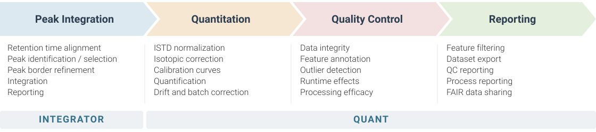

# MRMhub <a href="https://slinghub.github.io/MRMhub/"></a>

<!-- badges: start -->
[](https://github.com/SLINGhub/MRMhub/releases) [](https://www.gnu.org/licenses/agpl-3.0) [](https://doi.org/10.64898/2025.12.20.695370) [](https://github.com/SLINGhub/MRMhub/actions/workflows/R-CMD-check.yml) [](https://app.codecov.io/gh/SLINGhub/MRMhub)
<!-- badges: end -->

[**MRMhub**](https://slinghub.github.io/MRMhub/) is an open-source, one-stop framework for reproducible, automated processing of targeted metabolomics and lipidomics data acquired by liquid chromatography–mass spectrometry (LC–MS) in Multiple Reaction Monitoring (MRM) mode. Addressing well-known gaps in the robustness and scalability of existing software, it takes an experiment from raw instrument data to quality-controlled quantitative results, processing population-scale studies within minutes on standard hardware while recording a full digital footprint of every step for reproducibility and traceability. Built for both analytical and bioinformatics scientists, MRMhub provides modular functions and defined data structures that adapt to diverse study designs and data formats, supporting customizable, fully documented end-to-end workflows across two complementary modules:

- **INTEGRATOR** (the `MRMhub` binary) - a fast, memory-efficient, multithreaded standalone application for consensus-based peak integration across large analysis sequences, with per-feature integration settings. It reads mzML (vendor raw files converted via [msconvert](https://proteowizard.sourceforge.io/)) and exports integrated peak areas that feed directly into QUANT or other post-processing tools. [Learn more ↗](https://slinghub.github.io/MRMhub/integrator/)
- **QUANT** (the `mrmhub` R package) - a programmatic library for building tailored, reproducible post-processing and quality-control pipelines. It reads INTEGRATOR results directly, or feature-intensity data from other sources (CSV, mzTab-M, Skyline). [Learn more ↗](https://slinghub.github.io/MRMhub/quant/)

<br>

<p align="center">
  
</p>

## Installation

- **INTEGRATOR:** download the macOS or Windows build from [Releases](https://github.com/SLINGhub/MRMhub/releases), but read the [INTEGRATOR installation guide](https://slinghub.github.io/MRMhub/integrator/setup.html) first (for first-launch security warnings and project setup).
- **QUANT:** install from [GitHub](https://github.com/SLINGhub/MRMhub) in a fresh RStudio/Positron session (requires R ≥ 4.1). Please read the [QUANT installation guide](https://slinghub.github.io/MRMhub/quant/articles/manual-00-installation.html) first for full instructions and troubleshooting.

  ```r
  if (!require("pak")) install.packages("pak")
  pak::pak("SLINGhub/MRMhub")
  library(mrmhub)
  ```

## Getting started

→ **Browse analyses** - [MRMhub-workflows ↗](https://slinghub.github.io/MRMhub-workflows/) shows annotated, end-to-end data-processing reports from large-scale lipidomics analyses and a fully quantitative assay.

→ **Run the demo** - download the [latest release ↗](https://github.com/SLINGhub/MRMhub/releases) and follow the bundled `readme.txt` to process the demo project end-to-end with both modules.

## Documentation

- **INTEGRATOR manual ↗** - <https://slinghub.github.io/MRMhub/integrator/> (setup, input files, msconvert)
- **QUANT R package docs ↗** - <https://slinghub.github.io/MRMhub/quant/> (manual, tutorials, function reference)

## QUANT module usage

INTEGRATOR runs as a desktop app (see [Quick Start ↗](https://slinghub.github.io/MRMhub/integrator/quickstart.html)). QUANT is an R package. The example below runs on the bundled demo data and can be extended in the same way to quantitation, drift/batch correction, QC metrics, and feature filtering:

```r
library(mrmhub)

demo_file <- system.file("extdata", "MRMhub_demo.tsv", package = "mrmhub")

# `mexp` is the container holding all data and results across the script
mexp <- MRMhubExperiment() |>
  import_data_mrmhub(path = demo_file, import_metadata = TRUE) |>
  normalize_by_istd()

# Inspect ISTD-normalized signal for selected lipid classes (2 x 3 panel)
plot_runscatter(
  mexp,
  variable = "norm_intensity",
  rows_page = 2, cols_page = 3,
  include_feature_filter = "^(Cer|PC)"   # names as a vector or regex
)

# Export a multi-sheet QC report
save_report_xlsx(mexp, path = "results.xlsx")
```

## Authors & Contact

- **Bo Burla** - [bo.burla@nus.edu.sg](mailto:bo.burla@nus.edu.sg) [](https://orcid.org/0000-0002-5918-3249)
- **Guo Shou Teo** - [guoshou@nus.edu.sg](mailto:guoshou@nus.edu.sg) [](https://orcid.org/0000-0003-3891-1494)
- **Hyungwon Choi** - [hyung_won_choi@nus.edu.sg](mailto:hyung_won_choi@nus.edu.sg) [](https://orcid.org/0000-0002-6687-3088)

## Contributing

Bug reports and feature requests are welcome via [GitHub issues](https://github.com/SLINGhub/MRMhub/issues). The project follows the [Contributor Code of Conduct](https://contributor-covenant.org/version/2/0/CODE_OF_CONDUCT.html).

## Citation

Burla B. *et al.* (2025). *MRMhub: one-stop solution for automated processing of large-scale targeted metabolomics data.* bioRxiv. [doi:10.64898/2025.12.20.695370](https://doi.org/10.64898/2025.12.20.695370)

## License

Dual-licensed - non-commercial under [GNU AGPLv3](https://www.gnu.org/licenses/agpl-3.0.en.html). For commercial use contact Jonathan Tan (jonathan_tan@nus.edu.sg).
