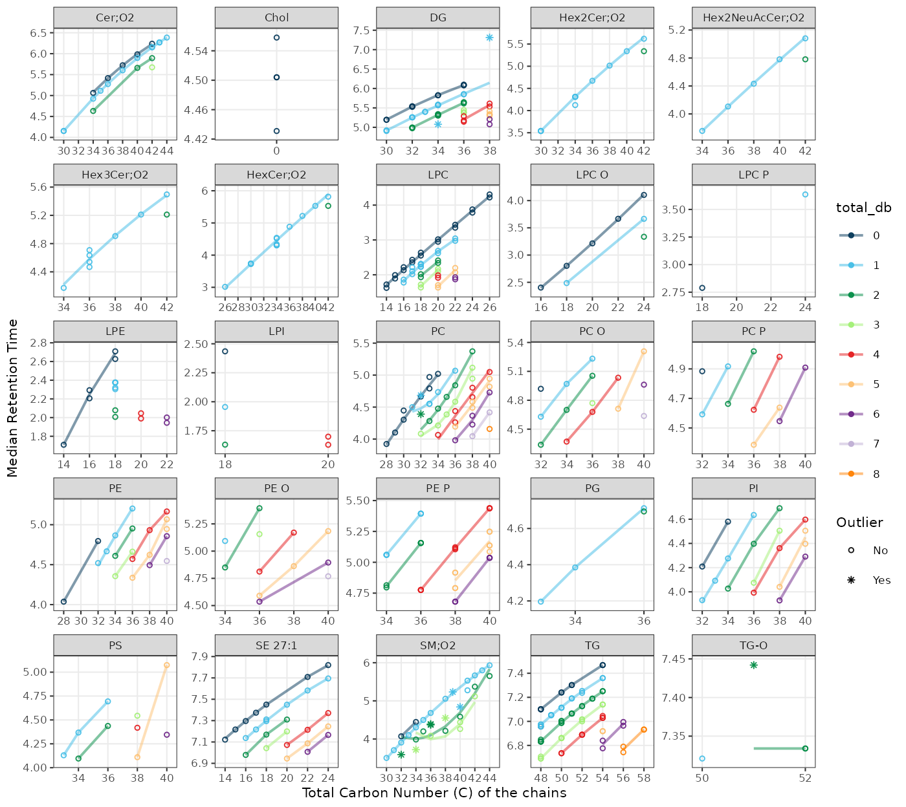
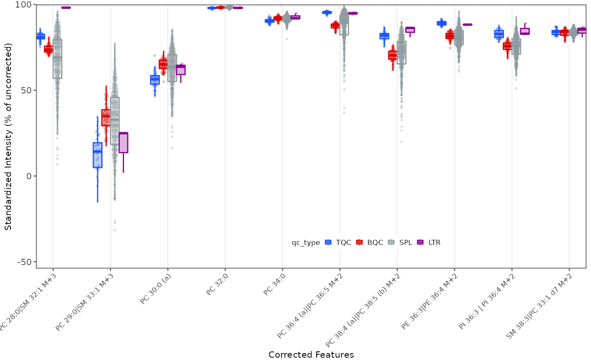
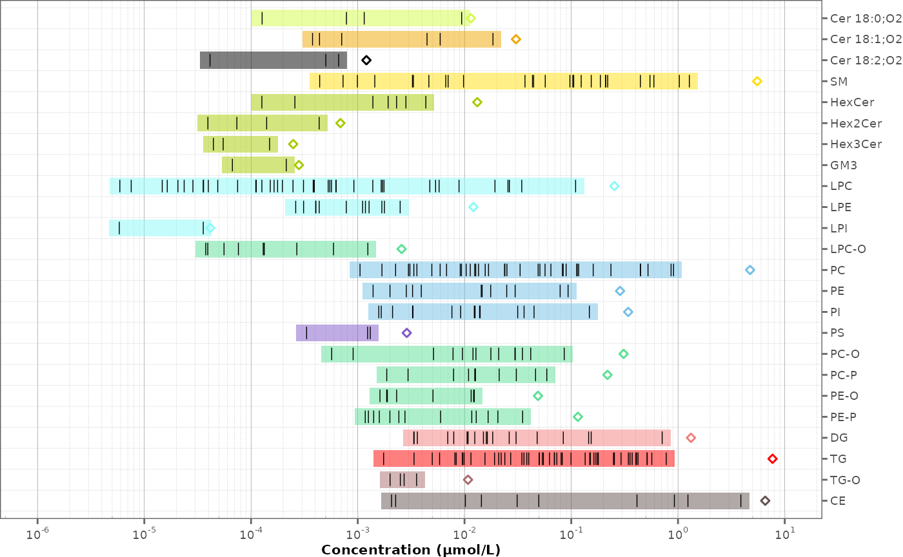

# Lipidomics Data Processing

This tutorial illustrates a postprocessing and quality control workflow
starting from a preprocessing data from an lipidomics analysis. Starting
from peak areas, the iam is to produce a curated dataset with lipid
species concentrations that is ready for subsequent statistical
analysss. This post-processing will include an assessment of the
analytical and data quality of the lipidomics analysis, followed by
normalisation/quantification, feature filtering and reporting of the
dataset.

``` r
library(mrmhub)
```

## 1. Importing analysis results

We begin by importing the MRMhub result file, which contains the areas
of the integrated peaks (features) in all the processed raw data files.
In addition, the MRMhub result file also contains peak retention times
and widths, as well as metadata extracted from the mzML files, such as
acquisition time stamp and m/z values. We import these metadata by
setting `import_metadata = TRUE`.

Exercises

> Type `print(myexp)` in the console to get a summary of the status. You
> can explore the `myexp` object in RStudio by clicking it in the
> Environment panel on the top right.

``` r
myexp <- mrmhub::MRMhubExperiment(title = "sPerfect")

data_path <- "datasets/sPerfect_MRMhub.tsv"
myexp <- import_data_mrmhub(data = myexp, path = data_path, import_metadata = TRUE)
#> ✔ Imported 499 analyses with 503 features
#> ℹ `feature_area` selected as default feature intensity. Modify with `set_intensity_var()`.
#> ✔ Analysis metadata associated with 499 analyses.
#> ✔ Feature metadata associated with 503 features.
```

## 2. A glimpse on the imported data

Let us examine the imported data by executing the code below or by
entering the command `View(myexp@dataset_orig)` in the console. As can
be observed, the data is in long format, thereby enabling the user to
view multiple parameters for each analysis-feature pair.

Exercises

> Explore the imported table using in the RStudio table viewer with the
> filter functionality.

``` r
print(myexp@dataset) # Better use `get_rawdata(mexp, "original")`
#> # A tibble: 250,997 × 20
#>    analysis_order analysis_id  acquisition_time_stamp qc_type batch_id sample_id
#>             <int> <chr>        <dttm>                 <chr>   <chr>    <chr>    
#>  1              1 Longit_BLAN… 2017-10-20 14:15:36    SBLK    1        NA       
#>  2              1 Longit_BLAN… 2017-10-20 14:15:36    SBLK    1        NA       
#>  3              1 Longit_BLAN… 2017-10-20 14:15:36    SBLK    1        NA       
#>  4              1 Longit_BLAN… 2017-10-20 14:15:36    SBLK    1        NA       
#>  5              1 Longit_BLAN… 2017-10-20 14:15:36    SBLK    1        NA       
#>  6              1 Longit_BLAN… 2017-10-20 14:15:36    SBLK    1        NA       
#>  7              1 Longit_BLAN… 2017-10-20 14:15:36    SBLK    1        NA       
#>  8              1 Longit_BLAN… 2017-10-20 14:15:36    SBLK    1        NA       
#>  9              1 Longit_BLAN… 2017-10-20 14:15:36    SBLK    1        NA       
#> 10              1 Longit_BLAN… 2017-10-20 14:15:36    SBLK    1        NA       
#> # ℹ 250,987 more rows
#> # ℹ 14 more variables: replicate_no <int>, specimen <chr>, feature_id <chr>,
#> #   feature_class <chr>, feature_label <chr>, is_istd <lgl>,
#> #   is_quantifier <lgl>, analyte_id <chr>, feature_rt <dbl>,
#> #   feature_area <dbl>, feature_height <dbl>, feature_fwhm <dbl>,
#> #   feature_width <dbl>, feature_intensity <dbl>
```

## 3. Analytical design and timeline

An overview of the analysis design and timelines can provide useful
information for subsequent processing steps. The plot below illustrates
the batch structure, the quality control (QC) samples included with
their respective positions, and additional information regarding the
date, duration, and run time of the analysis.

Exercises

> Show analysis timestamps with `show_timestamp = TRUE`. Have there been
> long interruptions within and between the batches?

``` r
plot_runsequence(
  myexp, 
  qc_types = NA, 
  show_batches = TRUE, 
  batch_zebra_stripe = TRUE, 
  batch_fill_color = "#fffbdb", 
  segment_linewidth = 0.5,
  show_timestamp = FALSE)
```


## 4. Overview Chromatographic Separation

The following plot shows the retention time distribution of all detected
lipid species.

``` r
plot_abundanceprofile(
  data = myexp,
  log_scale = FALSE,
  variable = "rt", 
  density_strip = TRUE,
  qc_types = "SPL",
  show_sum = FALSE,
  x_label = NA,
  feature_map = "lipidomics")
```


## 5. Peak picking QC

To check for potential peak picking errors, the retention time (RT) of
lipid features can be plotted against the total carbon count and double
bond number. Featyures that deviate from the trend are labelled and
indicate potential misannotations or peak picking errors. However, the
robustness of this approach depends on the comprehensiveness of the
lipid species covered in the analysis. In this example, only a limited
number of lipid featires were measured, and thus the trend is not well
defined for some classes and double bond counts.

``` r
plot_rt_vs_chain(
  myexp, 
  qc_types = "SPL", 
  x_var = "total_c", outlier_residual_min = 0.3,
  base_font_size = 8, 
  point_size = 1)  
#> ℹ The following features were flagged as potential annotation outliers: DG 18:1_20:0 [-18:1], DG 14:1_20:0 [-20:0], PC 32:1, PC 32:2, SM 40:1, SM 39:1, SM 36:2, SM 36:2 d9 (ISTD), SM 32:2, SM 38:3|PC 33:1 d7 M+2, SM 34:3, TG O-51:2 [-18:1]
```



## 6. Signal trends of Internal Standards

We can look at the internal standards (ISTDs) in all samples across all
six batches to see how the analyses went. The same ISTD amount was
spiked into each sample (except `SBLK`) so we should expect the same
intensities in all samples and sample types.

Exercises

> What do you observe? You can set `output_pdf = TRUE` to save the plots
> as PDF (see subfolder `output`).

``` r
plot_runscatter(
  data = myexp,
  variable = "intensity",
  qc_types = c("BQC", "TQC", "SPL", "PBLK", "SBLK"),
  #analysis_range = NA, #get_batch_boundaries(myexp, c(1,6)), 
  include_feature_filter = "ISTD", 
  exclude_feature_filter = "Hex|282",
  cap_outliers = TRUE,
  log_scale = FALSE, 
  show_batches = TRUE,base_font_size = 5,
  output_pdf = FALSE,
  path = "./output/runscatter_istd.pdf",
  cols_page = 4, rows_page = 3
)
#> Generating plots (3 pages)...
```


    #>  ■■■■■■■■■■■■■■■■■■■■■             67% |  ETA:  1s


## 7. Adding detailed metadata

To proceed with further processing, we require additional metadata
describing the samples and features. The `MRMhub Excel template`
provides a solution for the collection, organisation and pre-validation
of analysis metadata. Import metadata from this template using the
function below. If there are errors in the metadata (e.g. duplicate or
missing ID), the import will fail with an error message and summary of
the errors. If the metadata is error-free, a summary of warnings and
notes about the metadata will be shown in a table, if present. Check
your metadata by working through these warnings, or proceed using
`ignore_warnings = TRUE`.

Exercises

> Open the `XLSM` file in the `data` folder to explore the metadata
> structure (click ‘Disable Macros’).

``` r
file_path <- "datasets/sPerfect_Metadata.xlsm"
myexp <- import_metadata_msorganiser(myexp, path = file_path, ignore_warnings = TRUE)
#> ! Metadata has following warnings and notifications:
#> --------------------------------------------------------------------------------------------
#>   Type Table    Column                Issue                           Count
#> 1 W*   Analyses analysis_id           Analyses not in analysis data      15
#> 2 W*   Features feature_id            Feature(s) not in analysis data     4
#> 3 W*   Features feature_id            Feature(s) without metadata         1
#> 4 W*   ISTDs    quant_istd_feature_id Internal standard(s) not used       1
#> --------------------------------------------------------------------------------------------
#> E = Error, W = Warning, W* = Supressed Warning, N = Note
#> --------------------------------------------------------------------------------------------
#> ✔ Analysis metadata associated with 499 analyses.
#> ✔ Feature metadata associated with 502 features.
#> ✔ Internal Standard metadata associated with 17 ISTDs.
#> ✔ Response curve metadata associated with 12 annotated analyses.
myexp <- set_analysis_order(myexp, order_by = "timestamp")
#> ✔ Analysis order set to "timestamp"
myexp <- set_intensity_var(myexp, variable_name = "area")
#> ✔ Default feature intensity variable set to "feature_area"
```

## 8. Overall trends and possible outlier

To examine overall technical trends and issues affecting the majority of
analytes (features), the RLA (Relative Log Abundance) plot is a useful
tool (De Livera et al., Analytical Chemistry, 2015). In this plot, all
features are normalised (by across or within-batch medians) and plotted
as a boxplot per sample. This plot can help to identify potential
pipetting errors, sample spillage, injection volume changes or
instrument sensitivity changes.

Exercises

> First, run the code below as it is. What observations can be made?
> Then, examine batch 6, by uncommenting the line
> `#plot_range_indices =`. What do you see in this batch? Identify the
> potential outlier sample by setting `x_axis_variable = "analysis_id"`.
> Next, set the y-axis limits manually `y_lim = c(-2,2)` and display all
> analyses/batches again to inspect the data for other trends or
> fluctuations.

``` r
mrmhub::plot_rla_boxplot(
  data = myexp,
  rla_type_batch = c("within"),
  variable = "intensity",
  qc_types = c("BQC", "SPL", "RQC", "TQC", "PBLK"), 
  filter_data = FALSE, 
  #analysis_range = get_batch_boundaries(myexp, batch_indices = c(5,6)), 
  #y_lim = c(-3,3),
  show_timestamp = FALSE,
  outlier_exclude= FALSE, x_gridlines = FALSE,
  batch_zebra_stripe = FALSE,
  linewidth = 0.1
)
#> ℹ Found 40 outliers in the 487 shown analyses
```


## 9. PCA plot of all QC types

A principal component analysis (PCA) plot provides an alternative method
for obtaining an overview of the study and quality control (QC) samples,
as well as for identifying potential issues, such as batch effects,
technical outliers, and differences between the sample types.

Exercises

> Add blanks and sample dilutions to the plot, by including
> `"PBLK", "RQC"` to `qc_types =` below. What do you think the resulting
> PCA plot suggests now?

``` r
plot_pca(
  data = myexp, 
  variable = "feature_intensity", 
  filter_data = FALSE,
  pca_dims = c(1,2),
  labels_threshold_mad = 3, 
  qc_types = c("SPL", "BQC", "TQC"),
  log_transform = TRUE,  
  point_size = 2, point_alpha = 0.7, font_base_size = 8, ellipse_alpha = 0.3, 
  include_istd = FALSE)
#> ! 2 features contained missing or non-numeric values and were exluded.
#> ℹ The PCA was calculated based on `feature_intensity` values of 423 features.
```


## 10. Exclude technical outliers

Based on the above RLA and PCA plots, we flagged a technical outlier and
decided to remove it from all downstream processing via the function
`exclude()`.

Exercises

> What do we now see in the new PCA plot? Explore also different PCA
> dimensions (by modifying `pca_dim`).

``` r
 # Exclude the sample from the processing
myexp <- exclude_analyses(myexp, analyses = c("Longit_batch6_51"), clear_existing  = TRUE)
#> ℹ 1 analyses were excluded for downstream processing. Please reprocess data.

# Replot the PCA
plot_pca(
  data = myexp,
  variable = "intensity",
  filter_data = FALSE,
  pca_dim = c(1,2),
  labels_threshold_mad = 3,
  qc_types = c("SPL", "BQC", "TQC"),
  log_transform = TRUE,
  point_size = 2, point_alpha = 0.7, font_base_size = 8, ellipse_alpha = 0.3,
  include_istd = FALSE,
  shared_labeltext_hide = NA)
#> ! 2 features contained missing or non-numeric values and were exluded.
#> ℹ The PCA was calculated based on `feature_intensity` values of 423 features.
```


## 11. Response curves

A linear response in quantification is a prerequisite for to compared
differences in analyte concentrations between samples. Given the
considerable dynamic range of plasma lipid species abundances and the
fact that the class-specific ISTD is spiked at a single concentration,
verifying the linear response can be a valuable aspect of the analytical
quality assessment. While optimising the injected sample amount is
primarily a matter of quality assurance (QA), differences in instrument
performance can affect the dynamic range. Therefore, we measured
injection volume series at the start and end of this analysis as a QC.

Exercises

> Look at the response curves below. What do we see from these results?
> Change the plotted lipid species by modifying `include_feature_filter`
> (it can use regular expressions). Save a PDF of all lipids by setting
> `output_pdf = TRUE` and commenting out (add a `#` in front of)
> `include_feature_filter`

``` r
# Exclude very low abundant features
myexp <- mrmhub::filter_features_qc(myexp, 
                                   include_qualifier = FALSE,
                                   include_istd = TRUE,
                                   min.intensity.median.spl = 200)
#> Calculating feature QC metrics - please wait...
#> ✔ New feature QC filters were defined: 437 of 448 quantifier features meet QC criteria (including the 25 quantifier ISTD features).
plot_responsecurves(
  data = myexp,
  variable = "intensity",
  filter_data = TRUE,
  include_feature_filter = "^PC 3[0-5]", # here we use regular expressions
  output_pdf = FALSE, path = "response-curves.pdf",
  cols_page = 5, rows_page = 4,
)
#> Registered S3 methods overwritten by 'ggpp':
#>   method                  from   
#>   heightDetails.titleGrob ggplot2
#>   widthDetails.titleGrob  ggplot2
#> Generating plots (1 page):
#>   |                                      |                              |   0%
```


    #>   |                                      |==============================| 100%
    #>   done!

## 12. Isotope interference correction

As demonstrated in the course presentation, there are several instances
where the peaks of interest were co-integrated with the interfering
isotope peaks of other lipid species. These intereferences can be
subtracted from the raw intensities (areas) using the below function,
which utilises information from the metadata. The relative abundances
for the interfering fragments were obtained using LICAR
(<https://github.com/SLINGhub/LICAR>).

Exercises

> Check the sheet “Features (Analytes)” in the metadata file (folder
> `data`). Which species were affected? Which information will you need?
> Why should we correct for M+3 isotope interference?

``` r
myexp <- mrmhub::correct_interferences(myexp)
#> ! Interference correction led to negative or zero values in 2 feature(s) in samples/QCs. Please verify the correction, or set `neg_to_na = TRUE`
#> ✔ Interference-correction has been applied to 10 of the 502 features.
plot_qc_interferences(myexp, qc_types = c("BQC", "SPL", "TQC", "LTR"))
```



## 13. Normalization and quantification based on ISTDs

The first step is to normalize each lipid species with its corresponding
internal standard (ISTD). Subsequently, the concentrations are
calculated based on the volume of the spiked-in ISTD solution, the
concentration of the ISTDs in this solution, and the sample volume.

Exercises

> Visit the metadata template to view the corresponding details. You can
> also try to re-run e.g. above RLA and PCA plots with
> `variable = "norm_intensity"` or `variable = "conc"` to plot the
> normalized data.

``` r
myexp <- mrmhub::normalize_by_istd(myexp)
#> ✔ 460 features normalized with 17 ISTDs in 498 analyses.
myexp <- mrmhub::quantify_by_istd(myexp)
#> ✔ 460 feature concentrations calculated based on 42 ISTDs and sample amounts of 498 analyses.
#> ℹ Concentrations are given in μmol/L.
```

## 14. Examine the effects of class-wide ISTD normalization

The use of class-specific ISTDs is common practice in lipidomics.
However, non-authentic internal standards may elute at different times,
which can result in them being subject to different matrix effects and
thus different responses compared to the analytes. They may also differ
in their fragmentation properties, which can also affect the response.
Consequently, the use of non-authentic ISTDs for normalization can lead
to the introduction of artefacts, which can manifest as increases in
sample variability, rather than the expected reduction. It it therefore
important to assess ISTDs during QA in particular, but also as QC, and
to consider using alternative ISTDs when observing artefacts. One
approach to detecting potential ISTD-related artefacts is to compare the
variability of QC and samples before and after normalization.

Exercises

> What would you expect from such comarisons of CV? Do you notice
> potential issues with any of the ISTDs below? What could be possible
> explanations for such an effect? And what would you do in this
> situation?

``` r
myexp <- mrmhub::filter_features_qc(myexp, 
                                   include_qualifier = FALSE,
                                   include_istd = TRUE,
                                   min.intensity.median.spl = 1000)
#> Calculating feature QC metrics - please wait...
#> ✔ New feature QC filters were defined: 413 of 448 quantifier features meet QC criteria (including the 25 quantifier ISTD features).
mrmhub::plot_normalization_qc(
  data = myexp, 
  before_norm_var = "intensity", 
  after_norm_var = "norm_intensity",
  plot_type = "diff",
  point_size = 2,
  facet_by_class = TRUE,
  qc_types = c("TQC", "BQC", "SPL"),
  y_lim = c(-5, 15))
```


## 15. Drift correction

We’re going to use a Gaussian kernel smoothing based on the study sample
to correct for any drifts in the concentration data within each batch.
The summary return by the function below isn’t meant as actual
diagnostics of the fit, but rather to understand if the fit caused any
major artefacts. There is also an option to scale along the fit by
setting `scale_smooth = TRUE`.

``` r

myexp <- mrmhub::correct_drift_gaussiankernel(
  data = myexp,
  ignore_istd = TRUE,
  variable = "conc",
  ref_qc_types = c("SPL"),
  batch_wise = TRUE,
  replace_previous = TRUE,
  recalc_trend_after = TRUE,
  kernel_size = 10,
  #conditional_correction = 
  outlier_filter = FALSE,
  outlier_ksd = 5,
  location_smooth = TRUE,
  scale_smooth = FALSE, 
  show_progress = FALSE  # set to FALSE when rendering
)
#> ℹ Applying `conc` drift correction...
#> ℹ 4 feature(s) contain one or more zero or negative `conc` values. Verify your data or use `log_transform_internal = FALSE`.
#> ! 1 features showed no variation in the study sample's original values across analyses. 
#> ! 1 features have invalid values after smoothing. NA will be be returned for all values of these faetures. Set `use_original_if_fail = FALSE to return orginal values..
#> ✔ Drift correction was applied to 459 of 460 features (batch-wise).
#> ℹ The median CV change of all features in study samples was -1.00% (range: -12.53% to 2.59%). The median absolute CV of all features across batches decreased from 39.00% to 37.71%.
```

In order to demonstrate the correction, we will plot an example (PC
40:8) before and after the drift and batch correction. As we will be
using the same plot on several occasions, we create a simple function
that wraps the plot with many parameters preset.

``` r
# Define a wrapper function
my_trend_plot <- function(variable, feature){
  plot_runscatter(
    data = myexp,
    variable = variable,
    qc_types = c("BQC", "TQC", "SPL"),
    include_feature_filter = feature,
    exclude_feature_filter = "ISTD",
    cap_outliers = TRUE,
    log_scale = FALSE,
    show_trend = TRUE,
    output_pdf = FALSE,
    path = "./output/runscatter_PC408_beforecorr.pdf",
    cols_page = 1, rows_page = 1, 
  )
}
```

Exercises

> Let’s use this before defined function to plot the trends of one
> selected example before and after within-batch smoothing. What may
> have caused such a drift in the raw concentrations? Do the QC samples
> follow the trend of the sample? Look also at other lipid species.
>
> Try changing `batch_wise = FALSE` in the code chunk above with
> [`correct_drift_gaussiankernel()`](https://slinghub.github.io/MRMhub/reference/correct_drift_gaussiankernel.md)
> to run the run the smoothing across all batches. Would this be a valid
> alternative? NOTE: don’t forget to change back to `batch_wise = TRUE`
> after the test.

``` r
my_trend_plot("conc_before", "PC 40:8")
#> Generating plots (1 page)...
```


``` r
my_trend_plot("conc", "PC 40:8")
#> Generating plots (1 page)...
```


## 16. Batch-effect correction

As we observed, the trend lines of the different batches are not
aligned. We will use `correct_batcheffects()` to correct for median
center (location) and scale differences between the batches. The define
that the correction should be based on the study samples medians. An
optional scale correction can be performed by setting
`correct_scale = FALSE`. After the correction we directly plot our
example lipid species again.

Exercises

> Change the sample type to `qc_type = "BQC"` to use the BQC to center
> the batches. What do you observe?

``` r
myexp <- mrmhub::correct_batch_centering(
  myexp, 
  variable = "conc",
  ref_qc_types = "SPL",
  replace_previous = TRUE,
  correct_location = TRUE, 
  correct_scale = TRUE, 
  log_transform_internal = TRUE)
#> ℹ Adding batch correction on top of `conc` drift-correction.
#> ✔ Batch median-centering of 6 batches was applied to drift-corrected concentrations of all 460 features.
#> ℹ The median CV change of all features in study samples was -0.29% (range: -31.80% to 69.10%).  The median absolute CV of all features increased from 39.12% to 39.44%.

my_trend_plot("conc", "PC 40:8")
#> Generating plots (1 page)...
```


## 17. Saving *runscatter* plots of all features as PDF

For additional inspection and documentation, we can save plots for all
or a selected subset of species. It is often preferable to exclude
blanks, as they can exhibit random concentrations when signals of
features and internal standards are in close proximity or below the
limit of detection. The corresponding PDF can be accessed within the
`output` subfolder. Use `filt_` arguments to include or exclude specific
analytes. The filter can use regular expressions (regex). (Hint: try
using ChatGPT to generate more complex regex-based filters).

Exercises

Explore the effect of setting `cap_outliers` to `TRUE`or `FALSE`. Run
`?runscatter` in the console or press `F2` on the function name to see
all available options for
[`plot_runscatter()`](https://slinghub.github.io/MRMhub/reference/plot_runscatter.md).

``` r
plot_runscatter(
  data = myexp,
  variable = "conc",
  qc_types = c("BQC", "TQC", "SPL"),
  include_feature_filter =  NA,
  exclude_feature_filter = "ISTD",
  cap_outliers = TRUE,
  log_scale = FALSE,
  show_trend = TRUE,
  output_pdf = TRUE,
  path = "./output/runscatter_after-drift-batch-correction.pdf",
  cols_page = 2, 
  rows_page = 2,
  show_progress = TRUE
)
```

## 18. QC-based feature filtering

Finally, we apply a set of filters to exclude features that don’t meet
specific QC criteria. The available criteria can be seen by pressing
`TAB` after the first open bracket of
[`filter_features_qc()`](https://slinghub.github.io/MRMhub/reference/filter_features_qc.md)
function, or by to viewing the help page. by running
[`?filter_features_qc`](https://slinghub.github.io/MRMhub/reference/filter_features_qc.md)
in the console. The filter function can be applied multiple times,
either overwriting or amending (`clear_existing = FALSE`) previously set
filters.

Exercises

> Explore the effects of the different filtering criteria and filtering
> thresholds. The plot below in section 17 can be run in order to
> examine the effects visually.

``` r
myexp <- filter_features_qc(
  data = myexp, 
  clear_existing = TRUE,
  use_batch_medians = TRUE,
  include_qualifier = FALSE,
  include_istd = FALSE,
  response.curves.selection = c(1,2),
  response.curves.summary = "mean",
  min.rsquare.response = 0.8,
  min.slope.response = 0.75,
  max.yintercept.response = 0.5,
  min.signalblank.median.spl.pblk = 10,
  min.intensity.median.spl = 100,
  max.cv.conc.bqc = 25,
  features.to.keep = c("CE 20:4", "CE 22:5", "CE 22:6", "CE 16:0", "CE 18:0")
)
#> Calculating feature QC metrics - please wait...
#> ! The following features were forced to be retained despite not meeting filtering criteria: CE 16:0, CE 20:4, CE 22:5, and CE 22:6
#> ✔ New feature QC filters were defined: 324 of 423 quantifier features meet QC criteria (not including the 25 quantifier ISTD features).
```

## 19. Summary of the QC filtering

The plot below provides an overview of the data quality and the feature
filtering. The segments in green indicate the number of species that
passed all previously defined quality control (QC) filtering criteria.
The rest are the number of species that failed the different filtering
criteria. It should be noted that the criteria are hierarchically
organised; a feature is only classified as failing a criterion (e.g.,
`CV`) when it has passed the hierarchically lower filters (e.g., `S/B`
and `LOD`).

Exercises

> Are there any differences between lipid classes in terms of their
> analytical performance? What are the identified QC issues and what are
> possible explanations for these? What could be the implications if you
> want to run the next analysis?

``` r
mrmhub::plot_qc_summary_byclass(myexp) 
```


The following plot provides a further summary of the feature filtering
process, indicating the total number of features that have been
successfully filtered. As previously stated, the classification is based
on the hierarchical application of filters. The Venn diagram on the
right illustrates the number of features that have been excluded by a
particular filtering criterion.

Exercises

> Take a look at the Venn diagram. If a feature shows a bad or
> non-linear response (e.g. r2 \< 0.8), what could be the reasons for
> this?

``` r
mrmhub::plot_qc_summary_overall(myexp)
```


## 20. Lipidome Profile

As a final overview, the feature concentration profile of the filtered
dataset is shown below. Validating the concentrations, for example,
those of the most abundant species, the summed concentrations per lipid
class, or the ratios between lipid classes, against in-house reference
values or literature data helps ensure that the quantification is within
expected ranges and that no major quantification errors are present.

``` r
plot_abundanceprofile(
  data = myexp,
  log_scale = TRUE,
  filter_data = TRUE,
  variable = "conc", 
  qc_types = "SPL",
  #x_lim = c(-6, 2),
  x_label = NA,
  feature_map = "lipidomics")
```



## 21. Saving a report with data, metadata and processing details

A detailed summary of the data post-processing can be generated in the
form of an formatted `Excel` workbook comprising multiple sheets, each
containing raw and processed datasets, associated metadata, feature
quality control metrics, and information about the applied processing
steps.

Exercises

> Explore the report that was saved in the `output` folder.

``` r
mrmhub::save_report_xlsx(myexp, path = tempfile(fileext = ".xlsx"))
#> Saving report to disk - please wait...
#> ✔ The data processing report of experiment 'sPerfect' has been saved to '/tmp/RtmpLsSkKX/file393f1278931a.xlsx'.
```

You can also save specific data subsets as a clean flat, wide CSV file.
This is how we shared the data for the statistical analysis that will be
presented in the next part of this workshop!

Exercises

> Specify which data to export using function arguments and check the
> generated CSV files.

``` r
mrmhub::save_dataset_csv(
  data = myexp, 
  path = tempfile(fileext = ".csv"),
  variable = "conc", 
  qc_types = "SPL", 
  include_qualifier = FALSE,
  filter_data = TRUE)
#> ✔ Concentration values for 377 analyses and 324 features have been exported to '/tmp/RtmpLsSkKX/file393f60971e41.csv'.
```

## 22. Sharing the `MRMhubExperiment` dataset

The `myexp` object can be saved as an `RDS` file and shared. `RDS` files
are serialized R variables/objects that can be opened in R by anyone,
even in the absence of `mrmhub` package. The imported `MRMhubExperiment`
object can also be utilized for re-processing, plotting, or inspection
using the `mrmhub` package.

Exercises

> Save the dataset to the disk and re-open it under a different name.
> Check the status comparing it with the dataset generated in the
> workflow above (`mexp`)

``` r
path = tempfile(fileext = ".rds")
saveRDS(myexp, file = path, compress = TRUE)
my_saved_exp <- readRDS(file = path)
print(myexp)
#> 
#> ── MRMhubExperiment ────────────────────────────────────────────────────────────
#> Title: sPerfect
#> 
#> Processing status: Drift-Batch-corrected concentrations
#> 
#> ── Annotated Raw Data ──
#> 
#> • Analyses: 498
#> • Features: 502
#> • Raw signal used for processing: `feature_area`
#> 
#> ── Metadata ──
#> 
#> • Analyses/samples: ✔
#> • Features/analytes: ✔
#> • Internal standards: ✔
#> • Response curves: ✔
#> • Calibrants/QC concentrations: ✖
#> • Study samples: ✖
#> 
#> ── Processing Status ──
#> 
#> • Isotope corrected: ✔
#> • ISTD normalized: ✔
#> • ISTD quantitated: ✔
#> • Drift corrected variables: `feature_conc`
#> • Batch corrected variables: `feature_conc`
#> • Feature filtering applied: ✔
#> 
#> ── Exclusion of Analyses and Features ──
#> 
#> • Analyses manually excluded (`analysis_id`): Longit_batch6_51
#> • Features manually excluded (`feature_id`): ✖
```
