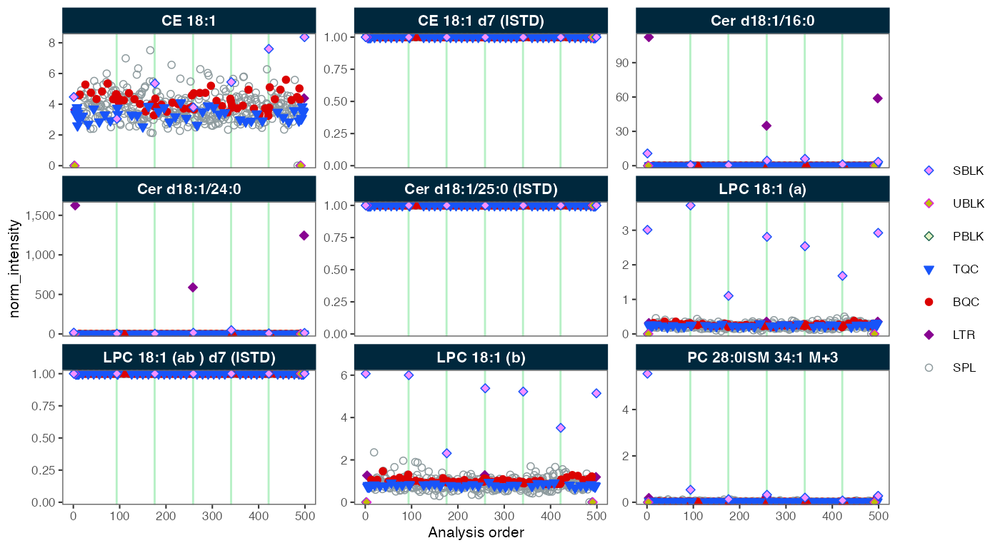
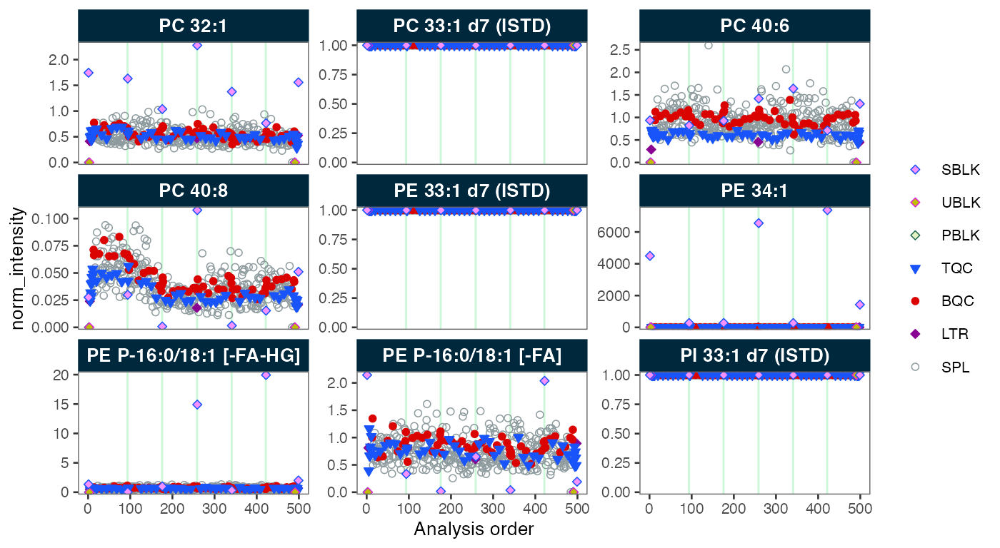
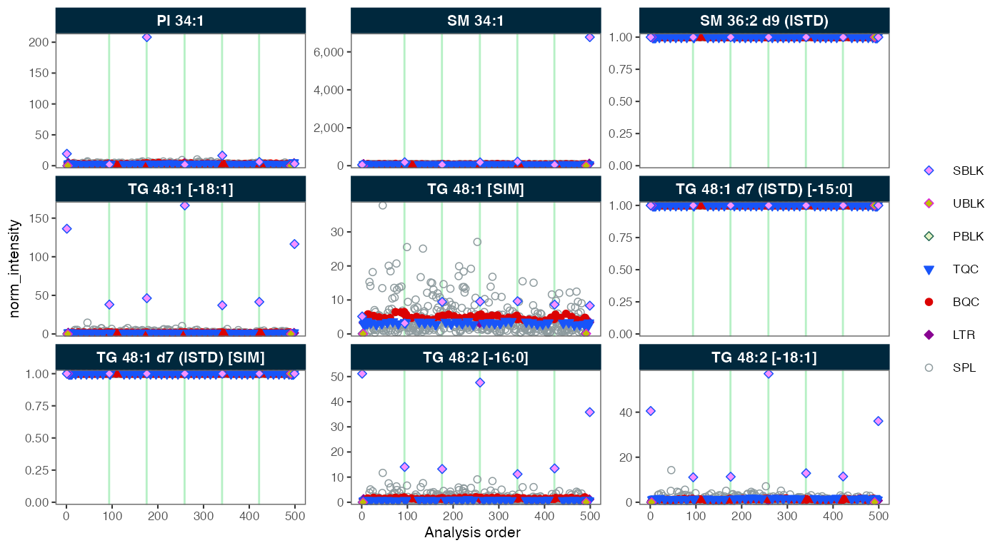
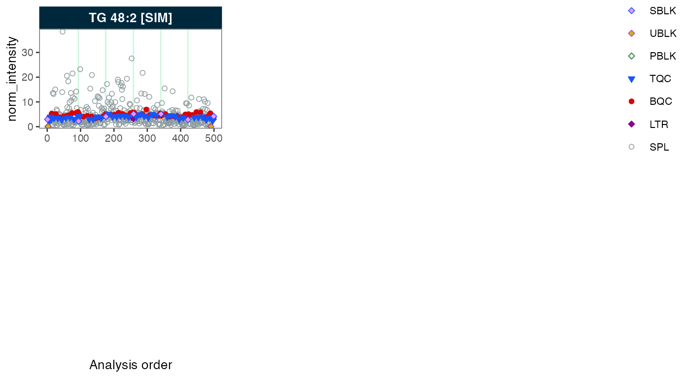

# Your First Analysis

Tutorial

This walkthrough produces a normalized dataset in under 5 minutes using
bundled demo data; no external files are needed.

**Time** ~5 min  ·  **Level** Beginner  ·  **Prerequisites** [MRMhub
installed](https://slinghub.github.io/MRMhub/quant/articles/manual-00-installation.md)

## The complete workflow in one script

The complete workflow on the bundled demo data is shown below. The
printed summary and plot are produced by this code.

``` r

library(mrmhub)

# 1. Import the bundled demo dataset (produced by INTEGRATOR)
demo_file <- system.file("extdata", "MRMhub_demo.tsv", package = "mrmhub")
mexp <- MRMhubExperiment()
mexp <- import_data_mrmhub(mexp, path = demo_file, import_metadata = TRUE)
mexp                        # compact overview; status(mexp) prints the full report

# 2. Normalise each feature by its internal standard
mexp <- normalize_by_istd(mexp)

# 3. Inspect the normalised signal across the analytical run
plot_runscatter(mexp, variable = "norm_intensity")
```



[`build_workflow()`](https://slinghub.github.io/MRMhub/quant/reference/build_workflow.md)
offers an interactive alternative — a point-and-click application that
validates your data and metadata, warns about any pipeline mismatches,
and generates an equivalent Quarto (`.qmd`) workflow to download (see
[Build a Workflow Without
Code](https://slinghub.github.io/MRMhub/quant/articles/tutorial-12-workflow-builder.md))
— while the code-first workflow above remains the reproducible path.
What each line does is described below.

## What the script does

The imported object is an `MRMhubExperiment`, a structured container
holding the peak area data, sample annotations, and feature metadata. A
few helpers summarise what was imported, and
[`normalize_by_istd()`](https://slinghub.github.io/MRMhub/quant/reference/normalize_by_istd.md)
corrects for extraction and injection variability; its result is
recorded in `mexp@is_istd_normalized`, and the original data is always
preserved in `mexp@dataset_orig`.

``` r

get_analysis_count(mexp)   # number of analyses
get_feature_count(mexp)    # number of features
get_featurelist(mexp)      # the feature list
```

## Exporting

Export the processed data to an Excel report (multiple sheets) or a tidy
CSV:

``` r

save_report_xlsx(mexp, path = "my_first_results.xlsx")
save_dataset_csv(mexp, path = "my_first_results.csv")
```

## Next steps

- [Key Concepts &
  Glossary](https://slinghub.github.io/MRMhub/quant/articles/manual-01-key-concepts.md)
  — understand the data model
- [Preparing and importing
  data](https://slinghub.github.io/MRMhub/quant/articles/tutorial-01-prep-data.md)
  — import your own data and metadata
- [Basic MRMhub
  Workflow](https://slinghub.github.io/MRMhub/quant/articles/tutorial-02-basic-workflow.md)
  — the full end-to-end pipeline
- [Lipidomics Data
  Processing](https://slinghub.github.io/MRMhub/quant/articles/tutorial-03-lipidomics-workflow.md)
  — a detailed real-world workflow
