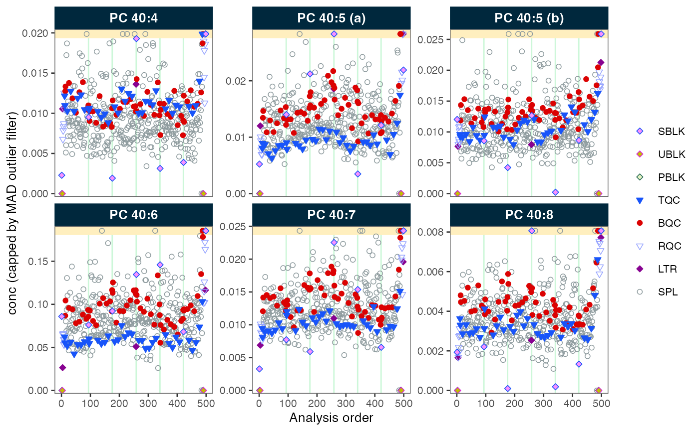

# Basic MRMhub Workflow

**Time:** ~15 min  \|  **Level:** Beginner–Intermediate  \| 
**Prerequisites:** [Your First
Analysis](https://slinghub.github.io/MRMhub/quant/articles/tutorial-00-first-analysis.md)

**How this differs from “Your First Analysis”:** That tutorial uses
bundled demo data and covers only import, normalize, and export in 5
minutes. This tutorial uses real file paths, imports metadata via
MSOrganiser, applies drift and batch correction, runs QC filtering, and
exports a full report — a realistic end-to-end workflow.

This tutorial outlines the key steps in a MRMhub workflow, based on a
lipidomics dataset. See the [Lipidomics Data
Processing](https://slinghub.github.io/MRMhub/quant/articles/tutorial-03-lipidomics-workflow.md)
tutorial for an even more detailed example.

These examples are simplified and may not apply to every dataset and
experimental setup. See other tutorials and recipes for additional
workflows and data types.

## Step 1: Set Up a Project

To start a new MRMhub data analysis, create an RStudio or Positron
project. (See [Using RStudio
Projects](https://support.posit.co/hc/en-us/articles/200526207-Using-RStudio-Projects)
or the [Positron User Guide](https://positron.posit.co/).)

The project should contain the following subfolders:

    my_study/
    ├── data/           # raw data and metadata files
    ├── output/         # exported results
    └── analysis.Rmd    # your processing notebook

R/Notebook (`.Rmd`) or
[Quarto](https://docs.posit.co/ide/user/ide/guide/documents/quarto-project.html)
(`.qmd`) files are good choices for documented processing workflows.
They combine code with formatted text to document every processing
decision.

Start with a new notebook or R script and load the `mrmhub` package:

``` r

library(mrmhub)
```

## Step 2: Create a MRMhubExperiment

The `MRMhubExperiment` object is the main **data container** in the
MRMhub workflow. See [The MRMhubExperiment
Object](https://slinghub.github.io/MRMhub/quant/articles/manual-04-mrmhub-experiment.md)
for details.

Create a new empty object:

``` r

myexp <- MRMhubExperiment()
```

## Step 3: Import Analysis Data

Import peak area data from an INTEGRATOR output file. This file also
contains some metadata (e.g., `qc_type`, `batch_id`) which we import at
the same time.

``` r

myexp <- import_data_mrmhub(
  data = myexp, 
  path = "datasets/sPerfect_MRMhub.tsv", 
  import_metadata = TRUE
)
#> ✔ Imported 499 analyses with 503 features
#> ℹ `feature_area` selected as default feature intensity. Modify with `set_intensity_var()`.
#> ✔ Analysis metadata associated with 499 analyses.
#> ✔ Feature metadata associated with 503 features.
```

**Using a different data source?**

See [Import and prepare data
files](https://slinghub.github.io/MRMhub/quant/articles/manual-05a-which-importer.md)
for a decision flowchart, or [Data
Import](https://slinghub.github.io/MRMhub/quant/articles/manual-05-data-import.md)
for the full API reference.

## Step 4: Add Metadata

Processing steps require additional information not available in the
data file: internal standard assignments, concentrations, sample
amounts, etc.

Metadata can be imported from separate CSV/Excel files or R data frames
(see [Metadata
Import](https://slinghub.github.io/MRMhub/quant/articles/manual-06-metadata-import.md)),
or from an MSOrganiser template:

``` r

myexp <- import_metadata_msorganiser(
  myexp, 
  path = "datasets/sPerfect_Metadata.xlsx", 
  ignore_warnings = TRUE
)
#> ! Metadata has following warnings and notifications:
#> --------------------------------------------------------------------------------
#> # A tibble: 4 × 5
#>   Type  Table    Column                Issue                           Count
#>   <chr> <chr>    <chr>                 <chr>                           <int>
#> 1 W*    Analyses analysis_id           Analyses not in analysis data      15
#> 2 W*    Features feature_id            Feature(s) not in analysis data     4
#> 3 W*    Features feature_id            Feature(s) without metadata         1
#> 4 W*    ISTDs    quant_istd_feature_id Internal standard(s) not used       1
#> 
#> --------------------------------------------------------------------------------
#> E = Error, W = Warning, W* = Suppressed Warning, N = Note
#> --------------------------------------------------------------------------------
#> ✔ Analysis metadata associated with 499 analyses.
#> ✔ Feature metadata associated with 502 features.
#> ✔ Internal Standard metadata associated with 17 ISTDs.
#> ✔ Response curve metadata associated with 12 annotated analyses.
```

The validation checks may produce warnings. Setting
`ignore_warnings = TRUE` allows the import to proceed, but warnings are
still displayed in the console (marked with `*`). Review them to ensure
nothing critical is missed.

**Validating metadata before import**

Use
[`assert_metadata()`](https://slinghub.github.io/MRMhub/quant/reference/assert_metadata.md)
to check annotation tables before linking. The function takes the
metadata as a named list and returns the validated list, which is then
passed to
[`add_metadata()`](https://slinghub.github.io/MRMhub/quant/reference/add_metadata.md):

``` r

validated <- assert_metadata(
  myexp,
  metadata = list(annot_analyses = annot_analyses,
                  annot_features = annot_features),
  ignore_warnings = FALSE,
  excl_unmatched_analyses = FALSE
)

myexp <- add_metadata(myexp, metadata = validated)
```

See [Validating and Fixing
Metadata](https://slinghub.github.io/MRMhub/quant/articles/tutorial-10-metadata-validation.md)
for a full walkthrough.

## Step 5: Process the Data

Apply normalization, quantification, drift correction, batch correction,
and QC filtering:

``` r

# Normalize by internal standards
myexp <- normalize_by_istd(myexp)
#> ! Interfering features defined in metadata, but no correction was applied. Use `correct_interferences()` to correct.
#> ✔ 460 features normalized with 17 ISTDs in 499 analyses.

# Quantify using ISTD-based approach
myexp <- quantify_by_istd(myexp)
#> ✔ 460 feature concentrations calculated based on 42 ISTDs and sample amounts of 499 analyses.
#> ℹ Concentrations are given in μmol/L.

# Correct run-order drift (Gaussian kernel, sample-based)
myexp <- correct_drift_gaussiankernel(
  data = myexp,
  variable = "conc",
  ref_qc_types = c("SPL")
)
#> ℹ Applying `conc` drift correction...
#> ℹ 2 feature(s) contain one or more zero or negative `conc` values. Verify your data or use `log_transform_internal = FALSE`.
#>  ■■■■■■■■■■■■■■■■■■■               61% |  ETA:  2s
#> ! 1 features showed no variation in the study sample's original values across analyses. 
#> ! 1 features have invalid values after smoothing. NA will be be returned for all values of these faetures. Set `use_original_if_fail = FALSE to return orginal values..
#> ✔ Drift correction was applied to 459 of 460 features (batch-wise).
#> ℹ The median CV change of all features in study samples was -0.56% (range: -10.22% to 2.49%). The median absolute CV of all features across batches decreased from 38.96% to 38.56%.

# Correct batch effects (median centering)
myexp <- correct_batch_centering(
  myexp, 
  variable = "conc",
  ref_qc_types = "SPL"
)
#> ℹ Adding batch correction on top of `conc` drift-correction.
#> ✔ Batch median-centering of 6 batches was applied to drift-corrected concentrations of all 502 features.
#> ℹ The median CV change of all features in study samples was -0.44% (range: -27.90% to 10.30%).  The median absolute CV of all features decreased from 38.99% to 38.76%.

# Apply QC-based feature filtering
myexp <- filter_features_qc(
  data = myexp,
  include_qualifier = FALSE,
  include_istd = FALSE, 
  min.signalblank.median.spl.sblk = 10,
  max.cv.conc.bqc = 25
)
#> Calculating feature QC metrics - please wait...
#> ! The QC parameter `min.signalblank.median.spl.sblk` contains NAs for following features: LPC O-22:1, PC 34:5, PC 35:1, PG 36:2, SM 35:1|PC P_32:1 M+1, and SM 35:1|PC .... 
#> These features failed QC.
#> ! The QC parameter `max.cv.conc.bqc` contains NAs for following features: Cer d18:1/12:0 (ISTD) [M-H20>264], Cer d18:1/25:0 (ISTD) [M-H20>264], Hex2Cer.... 
#> These features failed QC.
#> ✔ New feature QC filters were defined: 181 of 423 quantifier features meet QC criteria (not including the 25 quantifier ISTD features).
```

Note that the drift correction above uses the study samples
(`ref_qc_types = "SPL"`) as the reference. Study-sample smoothing is
only appropriate for large, well-randomised sample sets; the QC-based
convention (Broadhurst et al. 2018) instead fits the drift trend on
dedicated QC injections.

**Processing step order**

The recommended order is:

1.  Normalize by ISTD
2.  Quantify (ISTD or external calibration)
3.  Drift correction
4.  Batch correction
5.  QC filtering

See [Design
Overview](https://slinghub.github.io/MRMhub/quant/articles/manual-00-design-overview.md)
for the full pipeline diagram.

## Step 6: Visualize Results

Create a run scatter plot to check signal trends and correction quality:

``` r

plot_runscatter(
  data = myexp,
  variable = "conc",
  include_feature_filter = "PC 4",
  include_istd = FALSE,
  cap_outliers = TRUE,
  log_scale = FALSE,
  output_pdf = FALSE,
  path = "./output/runscatter_PC408_beforecorr.pdf",
  cols_page = 3, rows_page = 2
)
#> Generating plots (1 page)...
```



See [Visualisation
Functions](https://slinghub.github.io/MRMhub/quant/articles/manual-08-visualization.md)
for the full list of plotting functions grouped by workflow stage.

## Step 7: Export and Share

``` r

# Detailed Excel report with multiple sheets
save_report_xlsx(myexp, path = tempfile(fileext = ".xlsx"))
#> Saving report to disk - please wait...
#> ✔ The data processing report has been saved to '/var/folders/3r/ywcsb3896zj4_0xlb_70yvlh0000gn/T//RtmpXemyjG/filec6b97c428ed4.xlsx'.

# Flat CSV with concentration values that passed QC
save_dataset_csv(
  data = myexp, 
  path = tempfile(fileext = ".csv"),
  variable = "conc", 
  qc_types = "SPL", 
  include_qualifier = FALSE,
  filter_data = TRUE
)
#> ✔ Concentration values for 378 analyses and 181 features have been exported to '/var/folders/3r/ywcsb3896zj4_0xlb_70yvlh0000gn/T//RtmpXemyjG/filec6b93d1bbc8.csv'.

# Save the complete object for reproducibility or sharing
saveRDS(myexp, file = tempfile(fileext = ".rds"), compress = TRUE)
```

The `.rds` file preserves the entire `MRMhubExperiment` object. A
colleague can open it in R and run their own processing, plots, and QC
checks; no code is needed to reproduce the data state.

### Next Steps

- [Lipidomics
  Workflow](https://slinghub.github.io/MRMhub/quant/articles/tutorial-03-lipidomics-workflow.md)
  — more detailed lipidomics example
- [Drift
  Correction](https://slinghub.github.io/MRMhub/quant/articles/tutorial-04-drift-correction.md)
  — drift correction methods
- [Batch
  Correction](https://slinghub.github.io/MRMhub/quant/articles/tutorial-06-batch-correction.md)
  — batch correction options
- [PCA
  Exploration](https://slinghub.github.io/MRMhub/quant/articles/tutorial-09-pca-exploration.md)
  — QC exploration with PCA
- [External Calibration &
  QC](https://slinghub.github.io/MRMhub/quant/articles/recipe-01-ext-calibration-qc.md)
  — external calibration
