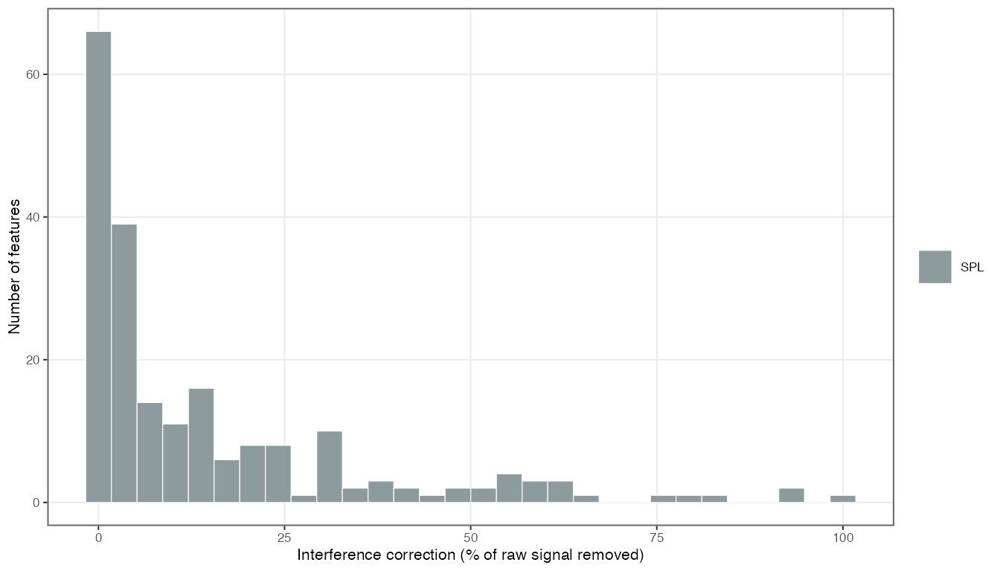
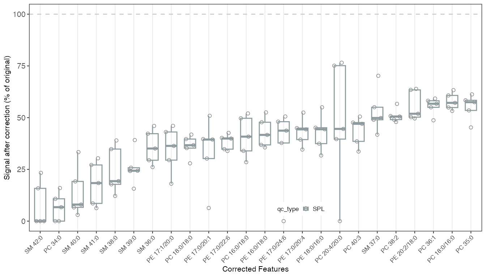

# Interference Correction

Tutorial

In class-based targeted assays, the natural-abundance heavy
isotopologues of one species can overlap the transition of a species two
mass units heavier, inflating its measured area. MRMhub derives these
isotopic (M+2) interference relationships automatically from a
per-feature `mrm_pattern` annotation and removes them with a
contribution-based subtraction ported from the LICAR method (Gao et al.
2021). Correction is worth considering whenever a blank shows non-zero
signal in a feature that should be empty, a species and its M+2 shoulder
correlate strongly across injections, or the theoretical M+2
contribution from an adjacent same-class species exceeds a few percent
of the target signal. It runs on raw feature intensities
(`feature_intensity`) and applies to *every* sample — unlike drift and
batch correction, which are fitted on QC samples only.

For MRM data the correction must be *fragment-based*: a heavy isotope’s
contribution depends on whether it lands on the retained product ion or
the neutral loss. The whole-molecule `level = "MS1"` path is therefore
for genuine full-scan data only, **never a fallback for MRM** data that
happens to lack a product m/z. The underlying concepts (front/back
overlaps, the co-elution requirement) are covered in the [Isotopic
interference
correction](https://slinghub.github.io/MRMhub/quant/articles/manual-12-interference-correction.md)
manual page.

**Time** ~15 min  ·  **Level** Advanced  ·  **Prerequisites** [Basic
workflow](https://slinghub.github.io/MRMhub/quant/articles/tutorial-02-basic-workflow.md)

## 1. Preparing for isotopic correction

Automatic derivation needs one annotation: the `mrm_pattern` column on
the `Features` metadata sheet, giving each feature its class + MRM
pattern. The label encodes both the lipid class and the product-ion
origin, so
[`calc_isotopic_interferences()`](https://slinghub.github.io/MRMhub/quant/reference/calc_isotopic_interferences.md)
can build the correct fragment formula. The precursor and product m/z
the derivation also needs — and the optional `polarity` that narrows the
pattern choices — can come from the imported data (INTEGRATOR) *or* the
metadata; only `mrm_pattern` must be annotated by hand. A `Features`
sheet ready for correction looks like this — precursor/product m/z and
`polarity` supplied by the import, with `mrm_pattern` added as the final
column:

| feature_id | feature_class | precursor_mz | product_mz | polarity | mrm_pattern |
|:---|:---|---:|---:|:---|:---|
| PC 34:2 | PC | 758.6 | 184.1 | Pos | PC (Pos) Pro=184.1 |
| PC 34:1 | PC | 760.6 | 184.1 | Pos | PC (Pos) Pro=184.1 |
| PC 34:0 | PC | 762.6 | 184.1 | Pos | PC (Pos) Pro=184.1 |
| Cer 18:1;O2/16:0 | Cer | 538.5 | 264.3 | Pos | Cer (Pos) SphB-2H2O |
| PC 34:1 \[FA 16:0\] | PC | 804.6 | 255.2 | Neg | PC (Neg, FA) FA |

Example `Features` metadata (`mrm_pattern` is the added annotation).
{.table}

The valid labels are listed by
[`licar_pattern_choices()`](https://slinghub.github.io/MRMhub/quant/reference/licar_pattern_choices.md):

``` r

library(mrmhub)
licar_pattern_choices("Head Group")
```

The metadata template
([`save_metadata_templates()`](https://slinghub.github.io/MRMhub/quant/reference/save_metadata_templates.md))
provides `mrm_pattern` as a filtered dropdown on the `Features` sheet,
with an optional `polarity` column that narrows the choices and colour
warnings when a species name does not match the chosen pattern’s class.
On import, MRMhub validates the column: an unknown label is an error,
and a name/pattern class mismatch or a sum-only name under a
chain-resolved (FA/LCB) pattern is a warning.

``` r

mexp <- readRDS("results/mexp_processed.rds")
```

## 2. Derive interference relationships

[`calc_isotopic_interferences()`](https://slinghub.github.io/MRMhub/quant/reference/calc_isotopic_interferences.md)
discovers the M+2 overlaps and stores them in the `annot_interferences`
slot. Choose the derivation `level` to match the acquisition:

``` r

# Class-based LC-MRM: fragment-level front/back correction (needs precursor + product m/z).
mexp <- calc_isotopic_interferences(mexp, level = "MRM")

# Genuine MS1 / full-scan: whole-molecule M+2 (needs precursor m/z only).
# mexp <- calc_isotopic_interferences(mexp, level = "MS1")
```

Derived factors are pinned to `enviPat` 2.8 (Loos et al. 2015) and are
deterministic, so re-importing the annotation and re-deriving reproduces
identical edges. Raise `min_contribution` to drop negligible or
borderline pairs, and see [co-elution
filtering](#co-elution-filtering-experimental) for the experimental
option to keep only chromatographically co-eluting pairs.

## 3. Inspect the derived relationships

The two-stage API is a built-in *preview*: review the derived edges
before subtracting anything. Each row of `annot_interferences` is one
overlap, with its contribution factor `K` and an `overlap_type`
(`m2_front`, `m2_back`, or `ms1_m2`):

``` r

mexp@annot_interferences
```

[`summarize_interferences()`](https://slinghub.github.io/MRMhub/quant/reference/summarize_interferences.md)
rolls this up — how many features are affected, split by source
(auto-derived vs. declared) and overlap type, with the
contribution-factor range:

``` r

summarize_interferences(mexp)
```

A victim carrying both a `m2_front` and a `m2_back` row is corrected
against two interferers. The `source` column distinguishes auto-derived
(`"auto"`) from declared (`"manual"`) edges.

## 4. Apply the correction

[`correct_isotopic_interferences()`](https://slinghub.github.io/MRMhub/quant/reference/correct_isotopic_interferences.md)
subtracts the derived edges from the raw intensities in one pass; its
reference page gives the subtraction formula, chain ordering, and
zero-clamping.

``` r

mexp <- correct_isotopic_interferences(mexp)
```

Run it **before** ISTD normalisation, drift, and batch correction —
applied later it resets those steps (with a warning), since they must
use the corrected raw signal. Raw values are preserved in
`feature_intensity_orig`. Declared interferences (in-source fragments,
co-eluting isobars, or other overlaps you annotate) are applied with the
sibling
[`correct_custom_interferences()`](https://slinghub.github.io/MRMhub/quant/reference/correct_custom_interferences.md).

## 5. Manual correction of a single pair

For a one-off correction, or to validate a factor before trusting the
automatic derivation, use
[`correct_interference_manual()`](https://slinghub.github.io/MRMhub/quant/reference/correct_interference_manual.md).
`variable` here is the actual `dataset` column name
(`feature_intensity`).

``` r

mexp <- correct_interference_manual(
  mexp,
  variable                  = "feature_intensity",
  feature                   = "PC 32:0",
  interfering_feature       = "SM 36:1 M+3",
  interference_contribution = 0.0107,
  neg_to_na                 = FALSE,
  updated_feature_id        = NA
)
```

Setting `updated_feature_id` renames the corrected feature so raw and
corrected channels can coexist. Manual factors can come from a
theoretical isotopologue calculation (`enviPat`), an empirical
pure-standard injection (which also captures Q1/Q3 transmission and
in-source effects), or published class-level tables — verify empirically
when moving a method between instruments.

## 6. Verifying the correction

``` r

d <- get_analyticaldata(mexp, annotated = TRUE) |>
  dplyr::filter(feature_id == "PC 32:0") |>
  dplyr::select(analysis_id, qc_type,
                intensity_before = feature_intensity_orig,
                intensity_after  = feature_intensity) |>
  dplyr::mutate(pct_change = 100 * (intensity_after - intensity_before) / intensity_before)

summary(d$pct_change)
```

For blanks (`SBLK`/`PBLK`), residual signal after correction should
approach zero. A non-zero blank median often indicates an underestimated
contribution factor.
[`plot_qc_interference_impact()`](https://slinghub.github.io/MRMhub/quant/reference/plot_qc_interference_impact.md)
shows how many features were affected by which magnitude of correction
(percent of signal removed) in the study samples:

``` r

plot_qc_interference_impact(mexp, qc_types = "SPL")
```



For a per-feature view,
[`plot_interference_correction()`](https://slinghub.github.io/MRMhub/quant/reference/plot_interference_correction.md)
shows each corrected feature’s residual signal as a percent of its
uncorrected value, split by QC type. `min_correction_pct` restricts it
to substantially-affected features (here, ≥ 40 % removed);
`sort_by_effect = "desc"` ranks them by correction magnitude and `top_n`
keeps only the largest. A blank approaching zero alongside study samples
(`SPL`) retaining most of their signal is the expected pattern:

``` r

plot_interference_correction(
  mexp, qc_types = "SPL", min_correction_pct = 40, sort_by_effect = "desc",
  point_size = 1.5, point_alpha = 0.8
)
```



Each point is one study sample; the box summarises all of them. `SPL`
points have a transparent fill, so raise `point_size` / `point_alpha`
when only a few are shown.

## Co-elution filtering (experimental)

An isotopologue elutes at its monoisotopic apex, so an interferer’s M+2
lands in a victim’s integrated area only if the two co-elute. The
experimental `check_coelution` option keeps an m/z-matched edge only
when the interferer’s apex falls inside the victim’s integration window,
dropping chromatographically resolved pairs:

``` r

mexp <- calc_isotopic_interferences(mexp, level = "MRM", check_coelution = TRUE)
```

It is **off by default** while the gate is validated. When enabled,
inspect `annot_interferences` carefully — resolved pairs it drops (and,
when retention data are missing, pairs it cannot verify) are reported in
the console.

## Next steps

- [Isotopic interference
  correction](https://slinghub.github.io/MRMhub/quant/articles/manual-12-interference-correction.md)
  — the conceptual reference
- [Drift and Batch
  Correction](https://slinghub.github.io/MRMhub/quant/articles/tutorial-04-drift-correction.md)
  — apply after interference correction
- [Basic MRMhub
  Workflow](https://slinghub.github.io/MRMhub/quant/articles/tutorial-02-basic-workflow.md)
  — full processing pipeline
- [The MRMhubExperiment Data
  Object](https://slinghub.github.io/MRMhub/quant/articles/manual-02-data-object.html#feature-variables)
  — how `_orig` postfixes preserve raw values

## References

Gao, Liang, Shanshan Ji, Bo Burla, Markus R. Wenk, Federico Torta, and
Amaury Cazenave-Gassiot. 2021. “LICAR: An Application for Isotopic
Correction of Targeted Lipidomic Data Acquired with Class-Based
Chromatographic Separations Using Multiple Reaction Monitoring.”
*Analytical Chemistry* 93 (6): 3163–71.
<https://doi.org/10.1021/acs.analchem.0c04565>.

Loos, Martin, Christian Gerber, Frederic Corona, Juliane Hollender, and
Heinz Singer. 2015. “Nontarget Screening with High-Resolution Mass
Spectrometry in the Environment: Ready to Go?” *Environmental Science &
Technology* 49 (3): 1857–65. <https://doi.org/10.1021/es5040179>.
