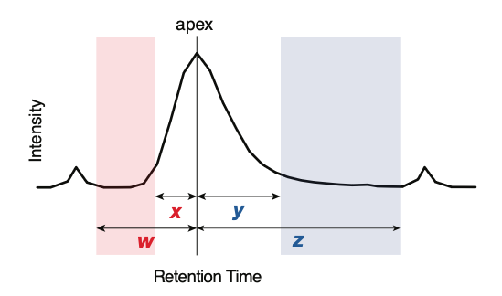

INTEGRATOR reads three input files together with the `mzML/` data folder. This page documents
each of them. For how the software uses these settings internally, see the
[Peak Detection and Integration Algorithm](algorithm.qmd).

## Global parameters (param.txt)

The software requires a global parameter file (`param.txt` by default), which directs it to the
required information and controls peak detection and integration.

| Parameter | Description | Default |
|---|---|---|
| `mzML_files` | Location of the mzML files used for peak integration. | `mzML` |
| `batch_info` | Input file listing the mzML file names and their metadata (see below). | `run_order.csv` |
| `transition_list` | Input file with the MRM transition information (see below). | `feature_list.csv` |
| `peak_width` | `[w, x, y, z]` define the allowed integration bounds: the left border falls *w–x* min and the right border *y–z* min from the apex (see below). | `[0.17, 0.05, 0.1, 0.35]` |
| `num_threads` | Number of CPU threads used for the integration task. | `2` |
| `mz_tol` | Tolerance between the indicated and the detected *m/z* values. | `0.06` |
| `RT_tol` | Tolerance between the indicated and the detected RT. A key setting when processing complex chromatograms. | `0.1` |
| `RT_shift` | `[x, y]` bound the RT drift relative to the reference samples: the peak may lie at most *x* min earlier and *y* min later than expected. The lower bound is written as a **negative** value (earlier RT); the upper bound is positive (later RT). Setting `[0, 0]` disables RT-shift correction. | `[-0.2, 0.2]` |
| `RT_shift_bound` | Maximum allowed RT drift between adjacent samples. | `0.1` |
| `crop_window` | A crop_window of [y, z] crops the chromatogram to a window spanning from y minutes before to z minutes after the indicated RT. | `[1.5, 2.0]` |

::: {.callout-tip}
**Worked example.** A published lipidomics dataset (Agilent triple-quadrupole) used
`mz_tol = 0.06`, `RT_tol = 0.04`, and `peak_width = [0.15, 0.08, 0.08, 0.18]` globally, with
per-feature overrides for broad or convoluted peaks, an RT-shift window of `(-0.1, 0.4)`, and a
maximum sample-to-sample RT shift (`RT_shift_bound`) of `0.05`. These values provide reasonable
starting points for a fast, well-resolved method. See the full
[Dataset 3 workflow ↗](https://slinghub.github.io/mrmhub-workflows/Dataset3.html) for the complete
input files and the resulting integration.
:::

{fig-align="center" width="70%"}

## Sample list (run_order.csv)

This file lists the data files to be processed. The file names must be given in their processing
order, from top to bottom. mzML files present in the data folder but not listed here are ignored.
Columns containing required information for individual data files are marked in **bold**.

| Column | Description |
|---|---|
| **file name** | The mzML file names to be processed, located in the folder defined under `mzML_files` in `param.txt`. Must include the `.mzML` extension. |
| batch | The analysis batch identifier the file belongs to. This value has no function inside INTEGRATOR, but is carried through to the result. |
| sample_type | The sample (QC) type of the corresponding sample. Blanks must be labelled with text containing `BLK`, as these are processed differently (see below). For all other cases, any sample type may be defined, and the information is forwarded to the integration results; the field may also be left empty. Use of the default MRMhub QC types (see [QUANT — Sample Types & QC Roles](https://slinghub.github.io/MRMhub/quant/articles/manual-00-sample-types.html)) is recommended to ensure reliable integration with the QUANT module. |
| reference | Indicates that the sample is used as a reference for RT-shift estimation (see below). Label with `x`. When selecting multiple samples, ensure they exhibit negligible RT shifts relative to one another. |

::: {.callout-note}
**How `sample_type` is used.** INTEGRATOR distinguishes only **blanks** (any `sample_type`
containing the text `BLK`), which are processed differently during peak finding, from
**non-blanks**. Every other sample/QC-type label has no effect inside INTEGRATOR; it is carried
through to `long.csv` for use by the QUANT module. Using the standard
[MRMhub QC nomenclature](https://slinghub.github.io/MRMhub/quant/articles/manual-00-sample-types.html)
here allows QUANT to assign the QC roles automatically.
:::

{fig-align="center" width="50%"}

## Transition / Feature list (feature_list.csv)

This file specifies the transitions to be processed and the features to be integrated for each
transition. Transitions present in the mzML files but not listed here are ignored. Columns
containing required information for each feature are marked in **bold**.

| Column | Description |
|---|---|
| **Compound Name** | Feature (analyte) identifier. Must be a unique value, typically identifying a single peak. Multiple distinct features can be defined for one transition. |
| **Transition Name** | Transition identifier. Values may be repeated. |
| ISTD | The internal standard feature assigned to the corresponding compound. This value currently has no function in the INTEGRATOR modules, but is included in the results and read by the QUANT module. May be left empty; if defined, it must correspond to a defined Compound Name. |
| **Precursor Ion** | The *m/z* value of the precursor ion. Must match the corresponding value in the mzML file within the tolerance set by `mz_tol` in `param.txt`. |
| **Product Ion** | The *m/z* value of the product ion. Must match the corresponding value in the mzML file within the tolerance set by `mz_tol` in `param.txt`. |
| **RT** | The expected retention time of the corresponding feature, in minutes. |
| uniform_width | Either `y` or `n` (default). If `y`, the peak boundaries are set to the median of the automatically determined borders. |
| left integration bound | Sets a fixed left peak border for all samples, in minutes (with respect to the reference sample). |
| right integration bound | Sets a fixed right peak border for all samples, in minutes (with respect to the reference sample). |
| peak width | `[w, x, y, z]` define the allowed integration bounds: left = *w–x* min, right = *y–z* min from the apex (see below). Overrides the globally defined `peak_width` in `param.txt`. |
| baseline | `default` / `v_drop` / `v2v` For `default`, the baseline is a horizontal line at the 5th percentile of data points within the window. For `v_drop` (vertical drop), it is a horizontal line at the lowest intensities of the integrated region. For `v2v` (valley to valley), it is a straight line connecting the left and right integration bounds.|
| chromatogram index | Allows the user to override the assignment of chromatograms to transitions. |
| Remarks | Used to document integration settings. |

## Effects of the key settings

Most settings trade **sensitivity** (finding and fully capturing the intended peak) against
**specificity** (not grabbing a neighbouring transition, an adjacent peak, or noise). The table
below summarises what happens at each extreme; the [peak-width recommendations](#recommendations-for-setting-peak-integration-parameters)
below provide further detail on `peak_width`, the most influential setting for difficult chromatograms.
For the algorithm that consumes these settings, see the
[Peak Detection and Integration Algorithm](algorithm.qmd).

| Setting | What it controls | Too **small/narrow** | Too **large/wide** |
|---|---|---|---|
| `mz_tol` | How far the detected *m/z* may deviate from the value in the transition list | A transition may not be matched at all if the instrument's *m/z* calibration is slightly off | A nearby transition / channel may be matched by mistake |
| `RT_tol` | The retention-time window searched around the expected RT (key for complex chromatograms) | The peak is missed when its RT drifts beyond the window | A wrong, co-eluting, or adjacent peak may be selected instead of the intended one |
| `peak_width` `[w,x,y,z]` | Allowed windows for the left (*w–x*) and right (*y–z*) peak borders, relative to the apex | Incomplete integration — tailing or broadened peaks get cut short | Smaller adjacent/interfering peaks get co-integrated into the area |
| `RT_shift` `[x,y]` | The maximum RT drift expected across the **reference** samples | Genuine drift between references is not accommodated, hurting peak tracking | The algorithm searches an unnecessarily wide window, raising the chance of picking the wrong peak |
| `RT_shift_bound` | The maximum RT drift allowed between **adjacent** samples | A real run-to-run RT jump can break sample-to-sample tracking | Spurious jumps may be followed, tracking drift that isn't there |
| `num_threads` | CPU threads used for integration | Slower processing only — no effect on results | Faster, bounded by available cores — no effect on results |

::: {.callout-tip}
Adjust **globally** in `param.txt` to suit the majority of peaks, then use **per-feature** overrides
in the transition list (`peak width`, `uniform_width`, fixed integration bounds) only for the
problematic minority. Always confirm the effect of a change visually in
[MRMhub-viz](viz.qmd) before re-integrating the whole dataset.
:::

## Recommendations for setting peak integration parameters

The `peak_width` parameter, defined globally in `param.txt` and
optionally per feature in the Transition List, is a key setting for
automated integration of complex chromatograms. Values are specified in
the format `[w, x, y, z]`, where the ranges *w–x* and *y–z* define the
allowed windows for the left and right peak borders, respectively. The
integration algorithm is constrained to set peak start and end points
within these ranges, even if its automatic boundary detection would
otherwise extend beyond them.

Ranges that are too narrow may lead to incomplete integration, particularly for
tailing peaks or peaks of unstable width, whereas ranges that are too wide may cause
smaller adjacent peaks to be included in the integration. A global setting that suits
the majority of peaks in the dataset should be defined in `param.txt`, with per-feature
settings applied to convoluted, asymmetric, or otherwise broadened peaks. Narrower
per-feature ranges can also be used where nearby interferences are not recognised as
separate peaks and are consequently co-integrated.

{fig-align="center" width="570" fig-alt="Schematic of a chromatographic peak illustrating the peak_width [w, x, y, z] parameter. Intensity is on the y-axis and retention time on the x-axis, with the apex marked by a vertical line. Short arrows x and y span the inner windows just left and right of the apex, while wider arrows w and z span the outer windows; the shaded bands mark the allowed ranges for the left border (w to x) and the right border (y to z) relative to the apex."}

![Examples of manually set peak boundaries in INTEGRATOR. (a, b) Effect of the `peak_width` parameter on a peak with clear tailing (PC 36:6): (a) the global setting, suitable for the majority of peaks, and (b) a feature-specific `peak width` overriding the global value for improved integration. (c, d) Effect on a peak with nearby interferences (PC O-38:4): (c) the global setting, and (d) an excessively wide `peak_width` that causes incorrect integration, underscoring the importance of an appropriate global value. (e, f) A complex chromatogram of three overlapping LPC 17:0 isomers: (e) the global setting yields only partial integration, with the first peak unrecognised, whereas (f) fixed boundaries defined for the first peak enable correct picking and integration of all three isomers.](images/paste-9.png){fig-align="center" width="100%"}

Set the `uniform_width` parameter to *true* for features whose integration
is correct in most samples but incorrect or inaccurate in a minority.

Use *fixed left/right integration bound times* where automated integration,
even after tuning the `peak_width` settings, does not correctly and consistently
integrate convoluted peaks or peaks with nearby interferences. These hard border
settings are recommended only as a last resort, since fixed borders may require
re-adjustment when the same analytical method is applied to other datasets.
***Note**:* These defined borders are still adjusted for retention-time shifts.

## Next

- [Peak Detection and Integration Algorithm](algorithm.qmd) — how these settings drive peak detection and integration.
- [Running INTEGRATOR](running.qmd) — run the four processing steps.
- [MRMhub-viz Visualizer](viz.qmd) — review results and fine-tune these parameters.
