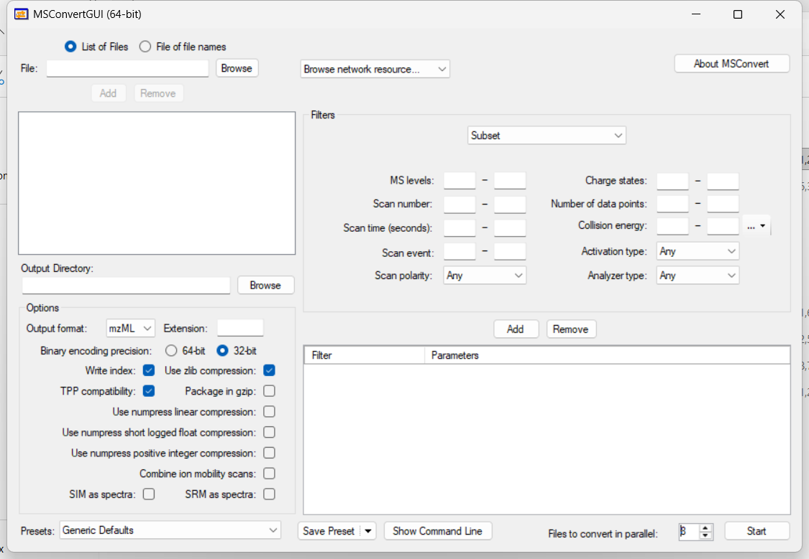

INTEGRATOR uses mzML files as input. The MSConvert tool, part of the
ProteoWizard software, converts proprietary raw data files (.wiff for
SCIEX, .raw folders for Waters, .raw files for Thermo Fisher, .d folders
for Agilent, etc.) into mzML format. This step can only be performed on a Windows PC.

1.  Download or upgrade to a recent version of ProteoWizard
    (<https://proteowizard.sourceforge.io>) on a Windows computer. A
    recent version ensures successful conversion of current
    vendor-specific formats.

2.  Start “MSConvert” via the START menu, or by right-clicking on the
    raw files to be converted and selecting MSConvertGUI.

3.  In the MSConvert window, use the “Browse” button to select the raw
    files to be converted. Note: .wiff and .wiff.scan files need to be
    located in the same folder.

4.  Set the following options: “*mzML*” for “*Output format”*, “*32-bit*”
    for “*Binary encoding precision*”, check “*Write index*" and to
    improve performance, increase "Files to convert in parallel" to the
    number of available CPU cores.

5.  Run the conversion by clicking "Start", and copy the mzML files to the
    MRMhub subfolder mzML

{fig-align="center" fig-alt="Screenshot of the MSConvertGUI window configured to output mzML. In the Options panel, Output format is set to mzML with 32-bit binary encoding, and Write index and Use zlib compression are enabled; the Start button at the bottom right runs the conversion."}

## Next

- [Download & Project Setup](setup.qmd) — download the standalone INTEGRATOR executable.
- [Running INTEGRATOR](running.qmd) — process your mzML files.