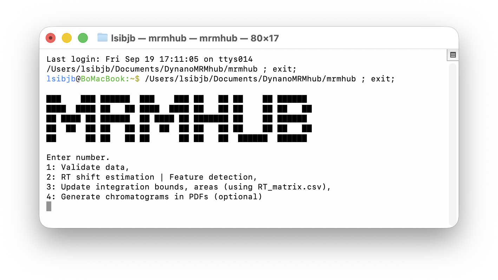

This short tutorial presents the steps to create a basic **peak integration project**. Input files are prepared, the integration run, and result inspected and integration refined.

::: {.callout-spaced}
::: {.callout-tip}
## Test data

Every INTEGRATOR release bundles a complete demonstration dataset, raw data (`.mzML`) together with
all required input files (see the [Demo](demo.html)). It is the quickest way to obtain working
files: run it directly as ready-made **test data** to follow the steps below, or copy its input
files as **templates** when setting up a new analysis.
:::
:::

## 1. Convert the raw files to mzML

INTEGRATOR requires MS raw data in the open **mzML** format. Native vendor files (e.g. Thermo
`.raw`, SCIEX `.wiff`, Agilent `.d`) must first be converted with ProteoWizard MSConvert (Windows
only), which needs to be done only once per dataset [→ mzML conversion](msconvert.html).

## 2. Set up the project

A project is a single, self-contained folder holding the executable, input files, raw data, and
results, keeping the full analysis and dataset transferable and reproducible. Assemble it as
follows; see [Installing MRMhub-INTEGRATOR](setup.html) for obtaining INTEGRATOR, the first-launch
security prompt, and the full project layout.

1. **Create the project folder** and move the `.mzML` files into a subfolder (e.g., `mzML/`).
2. **Add the INTEGRATOR tools** — the executables and the plotting script, from a
   [release](https://github.com/SLINGhub/MRMhub/releases) or an existing project.
3. **Add the input templates** — from a release or the
   [templates folder](https://github.com/SLINGhub/MRMhub/tree/development/integrator/templates).

::: {.filetree}
```
my-project/
├── MRMhub.exe / .app      ← peak-integration executable
├── MRMhub-viz.exe / .app  ← visualiser (optional)
├── MRMhub_plot.r          ← R script for creating chromatogram PDFs
├── mzML/                  ← the .mzML files
├── param.txt          ┐
├── run_order.csv      ├  input templates (step 3)
└── feature_list.csv   ┘
```

[Project folder layout prior to integration]{.tree-caption}
:::


## 3. Prepare the input files

Edit and review the input files that configure the peak integration run,  one global, and two defining the samples and the features. See the [Input Files reference](input-files.html) for description of all parameters.

::: {.compact-table}
| File | Configuration |
|---|---|
| [`param.txt`](input-files.html#global-parameters-param.txt) | Name and location of the input and mzML files, the global peak-detection and border-finding settings, and the RT-shift correction parameters. **Must be in the same folder as the MRMhub executable.** |
| [`run_order.csv`](input-files.html#sample-list-run_order.csv) | The mzML files to process, listed in run order, optionally, the reference sample(s) for RT-shift estimation. `sample_type` is optional, with only blanks (`BLK`) being treated specially |
| [`feature_list.csv`](input-files.html#transition-feature-list-feature_list.csv) | Transition precursor and product *m/z* values, transition and feature identifiers, the expected feature RT, optional per-feature integration settings. |
:::


## 4. Run INTEGRATOR
INTEGRATOR is launched from the project folder and its terminal menu is worked through in order; see
[Running INTEGRATOR](running.html) for the full reference. It is started by double-clicking `MRMhub`
(macOS) or `MRMhub.exe` (Windows), or from a terminal opened in the project folder.

{fig-align="center" width="70%" fig-alt="Screenshot of the INTEGRATOR terminal interface, showing the MRMHUB banner and its four-item menu: 1 Validate data; 2 RT-shift estimation and feature detection; 3 update integration bounds and areas using RT_matrix.csv; and 4 generate chromatogram PDFs (optional)."}

1. **Data Validation** — the input files are loaded and checked for inconsistencies (mzML files or transitions
   that are listed but missing, or present but unlisted). Report files are written only if problems
   are found (see file tree below)
2. **Peak Finding & RT-shift estimation** — peaks are detected and the retention-time shift across
   the sequence is estimated. Produces `RT_matrix.csv` (the detected peaks with their per-sample
   integration borders), which is required for step 3.
3. **Peak Integration** — the peaks from step 2 are integrated. Produces `long.csv` (the canonical
   hand-off to QUANT), `quant_raw.csv` (wide-format peak areas), and the `misc/` folder (binary
   results used by MRMhub-viz and step 4).
4. **Generate PDF results** *(optional)* — the integrated chromatograms are plotted as PDFs, grouped
   into `by_transition/`, `by_transition_low/`, and `by_sample/`.

The steps run in order, each using the previous one's output (steps 1–3 for a new dataset; step 4
optional). The application can be closed and reopened between steps — intermediate files persist, so
the run can be resumed. **Editing any input file, however, requires restarting from step 1.** The run adds these outputs to the project folder:

::: {.filetree}
```
my-project/
├── missing_files.txt     ┐
├── missing_compounds.txt ├ step 1: validation reports (only if problems found)
├── missing_details.txt   ┘
├── RT_matrix.csv         ← step 2: peaks + per-sample borders
├── long.csv              ← step 3: long-format integration results table 
├── quant_raw.csv         ← step 3: wide-format peak areas
├── misc/                 ← step 3: binary results (used for MRMhub-viz)
├── by_transition/        ┐
├── by_transition_low/    ├ step 4 (optional): chromatogram PDFs
├── by_sample/            ┘
└── …                     ← executable, mzML/, input files (unchanged)
```

[Files and folders added by the run, each annotated with the step that creates it]{.tree-caption}
:::

::: {.callout-important}
On first launch after download the operating system shows a one-time security prompt (macOS Gatekeeper /
Windows "Unblock"). See
[clearing the security prompt](setup.html#clearing-the-first-launch-security-prompt).
:::

## 5. Review the results

The chromatograms and peak integration results can be reviewed in either of two ways:

- **From the PDFs** (if step 4 was run) — the per-transition and per-sample PDFs can be browsed
  quickly with a file previewer: macOS Quick Look (press *Space*) or the Windows File Explorer
  preview pane, switching transitions with the arrow keys and scrolling with the mouse wheel.
- **Interactively in the MRMhub-viz app** — results are examined feature by feature.
  → [MRMhub-viz](viz.html)

Guided by the review, the global and per-feature settings can be refined and INTEGRATOR re-run,
until the integration is satisfactory across the sequence. Individual peak boundaries can also be
corrected per sample by editing `RT_matrix.csv` and re-running **only step 3** — re-running step 2
overwrites these manual edits.

## 6. Integration results

INTEGRATOR writes the integration results as different tables to the project folder:

- **`quant_raw.csv`** (wide format) — a features × samples matrix of **peak areas** only, with the
  precursor and product *m/z* and the median apex RT carried in the top rows.
- **`long.csv`** (long format) — one row per *sample × feature*, with  **area, height, FWHM,
  and apex RT** , and transition *m/z*, acquisition timestamp, and metadata from the input files.
- **`RT_matrix.csv`** — the **peak boundaries** per feature and sample, produced in step 2. These can be edited to adjust individual peaks
(see [Review the results](#review-the-results)).

See [Running INTEGRATOR](running.html#step-3-peak-integration) for the full definition of these file formats.

## 7. Post-processing

One recommended route is **MRMhub QUANT**, the
postprocessing module of MRMhub. An R package offering functions, which imports INTEGRATOR's `long.csv` directly for normalisation, drift and batch correction, calibration, quality control, and
reporting:

```r
mrmhub::import_data_mrmhub(path = "path/to/long.csv", import_metadata = TRUE)
```

→ [QUANT Quick Start ↗](https://slinghub.github.io/MRMhub/quant/articles/tutorial-00-first-analysis.html)  ·  [QUANT documentation ↗](https://slinghub.github.io/MRMhub/quant/) 

