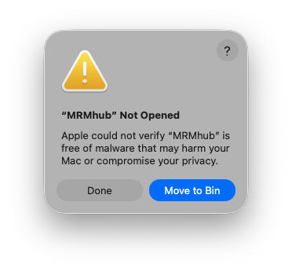
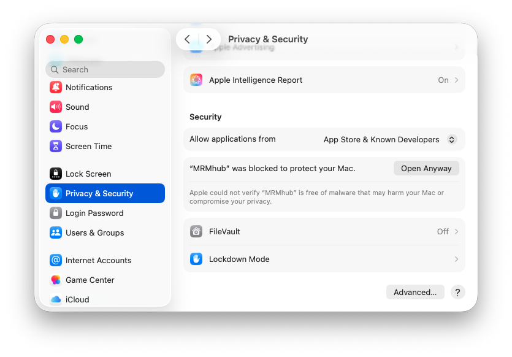
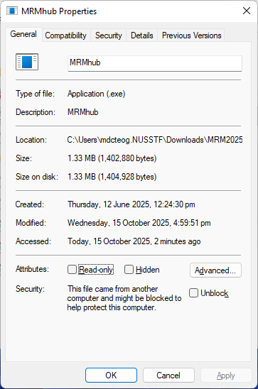

::: {.callout-important}
**INTEGRATOR is not installed.** It is a **self-contained, portable executable** — there is no
installer and nothing is added to your system. You simply download it, unzip it, and run it from a
folder.
:::

## One copy per project

The recommended way to work is to keep **one copy of the INTEGRATOR folder inside each data-analysis
project**, alongside that project's raw data and input files. Because the executable, the parameters
(`param.txt`), the input files, and the results all live together in one self-contained folder, the
**entire analysis stays re-runnable and reproducible** — you (or a colleague) can re-open the folder
months later, adjust a parameter, and re-run the integration exactly as before. It also means
different projects can use different versions of INTEGRATOR without interfering with each other.

::: {.callout-note}
**Just want post-processing in R?** INTEGRATOR is not required to use the QUANT R package — QUANT
imports directly from vendor outputs (MassHunter, Skyline) as well. See the
[QUANT documentation ↗](https://slinghub.github.io/MRMhub/quant/).
:::

## Get the application

INTEGRATOR comes as pre-compiled executables for Windows and macOS, which can be downloaded from
<https://github.com/SLINGhub/MRMhub/releases>. Unzip the downloaded file and copy the folder into
your project location. The folder comprises the following files and subfolders: **MRMhub** is the
main application, and **MRMhub-viz** is an application to review peak integration results.

## First launch (clear the security prompt)

The executable is unsigned, so the operating system shows a one-time security warning the first time
you run it. This is expected — clear it as follows.

On **macOS**, the following error is shown:

{fig-align="center"}

To resolve this, go to "**Systems Settings**", "**Privacy & Security**"
tab, and click "**Open Anyway**" button to enable the software.

{fig-align="center"}

On **Windows**, right-click on the executable, select
"**Properties**", and on the "**General**" tab, check the "**Unblock**"
box near the bottom if available, then click OK or Apply.

{fig-align="center"}

## Folder layout

The input files required by the **MRMhub** application are
`feature_list.csv`, `run_order.csv`, and `param.txt`. The mzML folder is
used to store MS raw data files. All of these are explained in
[Input Files](input-files.qmd).
Furthermore, this distribution contains a test dataset, with a complete
set of input and raw data files, which can be used as templates for
future analysis. The `MRMhub_plot.r` is an R script used to generate the
PDFs. It can be modified to tailor for specific layouts and design
features of the plots.

{fig-align="center" width="526"}

## Next

- [Input Files](input-files.qmd) — set up `param.txt`, `batch_info.csv`, and the transition list.
- [Running INTEGRATOR](running.qmd) — the four processing steps.
