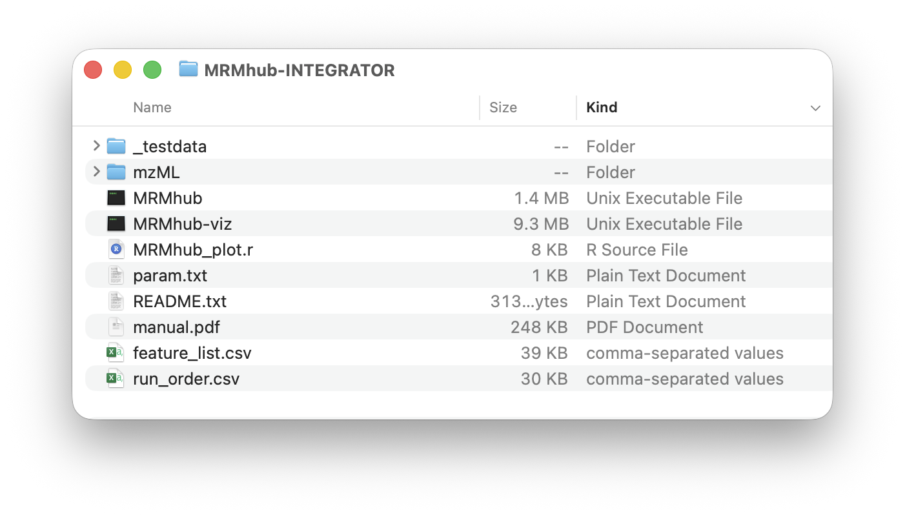
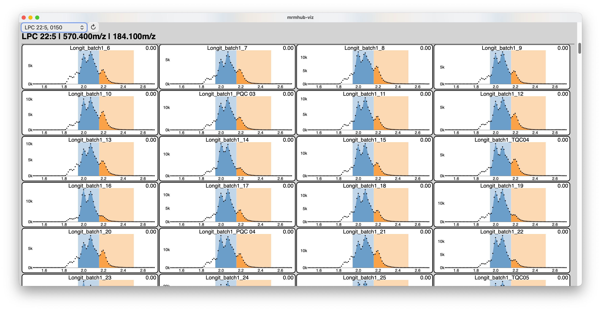
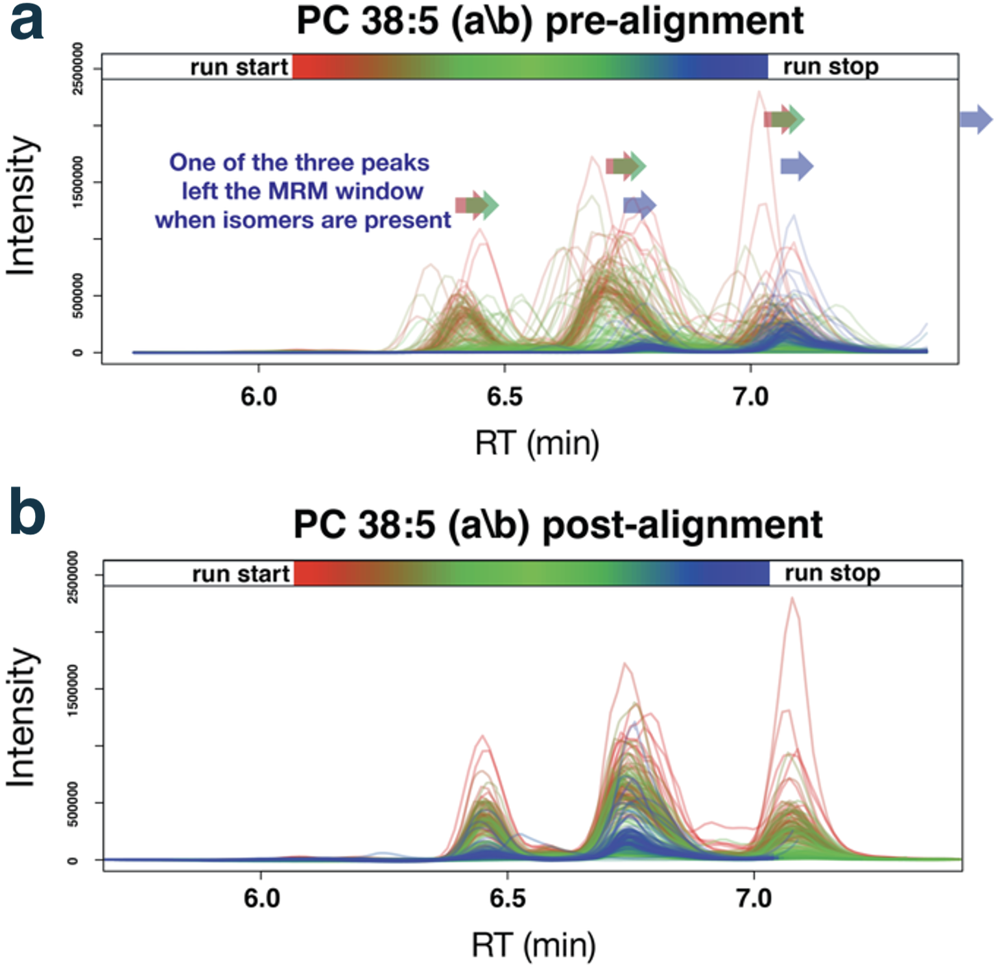
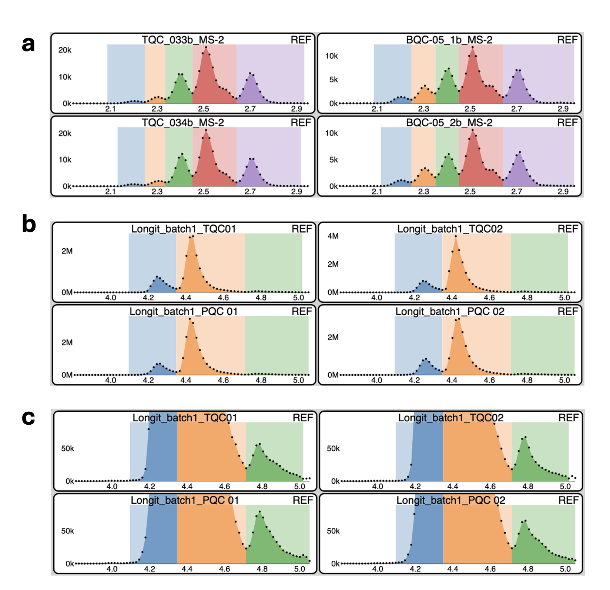

# Preparation of MRM raw files

INTEGRATOR uses mzML files as input. Users can use the MSconvert tool,
available as part of the Proteowizard software to convert proprietary
raw data files (.wiff for SCIEX, .raw files for Thermo Fisher, .d
folders for Agilent, etc) into mzML format. See the [MSconvert
Instructions](msconvert_manual.qmd) for details.

# Installation MRMhub app

The INTEGRATOR module comes with pre-compiled binaries for Windows OS
and macOS X, which can be download from
<https://github.com/SLINGhub/MRMhub/releases>. Unzip the downloaded file
and move the folder to the desired location. The folder comprises
following files and subfolders: **MRMhub** is the main application,
**MRMhub-viz** is an application to review peak integration results. The
input files required by the **MRMhub** application are
`feature_list.csv`, `run_order.csv`, and `param.txt`. The mzML folder is
used to store MS raw data files. All of these are explained below.
Futhermore, this distribution contains a test dataset, with a complete
set of input and raw data files, which can be used as templates for
future analysis. The `MRMhub_plot.r` is an R script used to generate the
PDFs. It can be modified to tailor for specific layouts and design
features of the plots.

{fig-align="center" width="526"}

# Input files

## Global parameters (param.txt)

The software requires global parameter file (param.txt by default),
which points the software to the required information.

+----------+----------+----------+
| P        | D e      | Default  |
| arameter | s        |          |
|          | cription |          |
+==========+==========+==========+
| mz       | Location | mzML     |
| ML_files | of mzML  |          |
|          | files to |          |
|          | be used  |          |
|          | for peak |          |
|          | i n      |          |
|          | t        |          |
|          | egration |          |
+----------+----------+----------+
| ba       | Input    | batch\_  |
| tch_info | file     | info.csv |
|          | with     |          |
|          | mzML     |          |
|          | file     |          |
|          | names    |          |
|          | and meta |          |
|          | i n      |          |
|          | f        |          |
|          | ormation |          |
|          | (see     |          |
|          | below)   |          |
+----------+----------+----------+
| transit  | Input    | f        |
| ion_list | file     | eature\_ |
|          | with MRM | info.csv |
|          | t        |          |
|          | r        |          |
|          | ansition |          |
|          | i n      |          |
|          | f        |          |
|          | ormation |          |
|          | (see     |          |
|          | below)   |          |
+----------+----------+----------+
| pe       | \[w, x,  | \[0.17,  |
| ak_width | y, z\]   | 0.05,    |
|          | define   | 0.1,     |
|          | allowed  | 0.35\]   |
|          | i n      |          |
|          | t        |          |
|          | egration |          |
|          | bounds:\ |          |
|          | left =   |          |
|          | w–x min, |          |
|          | right =  |          |
|          | y–z min  |          |
|          | from     |          |
|          | apex     |          |
|          | (see     |          |
|          | below).  |          |
+----------+----------+----------+
| num      | Number   | 2        |
| \        | of CPU   |          |
| _threads | threads  |          |
|          | to be    |          |
|          | used for |          |
|          | i n      |          |
|          | t        |          |
|          | egration |          |
|          | task.    |          |
+----------+----------+----------+
| mz_tol   | T        | 0.06     |
|          | olerance |          |
|          | between  |          |
|          | i        |          |
|          | ndicated |          |
|          | m/z and  |          |
|          | detected |          |
|          | m/z      |          |
|          | values   |          |
+----------+----------+----------+
| RT_tol   | T        | 0.1      |
|          | olerance |          |
|          | between  |          |
|          | i        |          |
|          | ndicated |          |
|          | RT and   |          |
|          | detected |          |
|          | RT.      |          |
|          | *        |          |
|          | *Note**: |          |
|          | This is  |          |
|          | a key    |          |
|          | setting  |          |
|          | in p     |          |
|          | r        |          |
|          | ocessing |          |
|          | or       |          |
|          | complex  |          |
|          | ch r o m |          |
|          | a        |          |
|          | tograms. |          |
+----------+----------+----------+
| RT_shift | \[x, y\] | \[-0.2,  |
|          | indicate | 0.2\]    |
|          | that RT  |          |
|          | drift is |          |
|          | at most  |          |
|          | x        |          |
|          | minutes  |          |
|          | left and |          |
|          | y        |          |
|          | minutes  |          |
|          | right of |          |
|          | the peak |          |
|          | in the   |          |
|          | r        |          |
|          | eference |          |
|          | samples  |          |
+----------+----------+----------+
| RT\_ s h | Maximum  | 0.1      |
| i        | allowed  |          |
| ft_bound | RT drift |          |
|          | between  |          |
|          | adjacent |          |
|          | samples  |          |
+----------+----------+----------+

## Sample list (batch_info.csv)

This file defines data files. The file names must be presented in their
processing order from top to bottom. mzML files present in the data
folder but not listed here will be ignored. Columns containing required
information for individual data files are marked in **bold**.

+---------------+-------------------------+
| Column        | Description             |
+===============+=========================+
| **file name** | The mzML file names to  |
|               | be processed, which are |
|               | in the folder defined   |
|               | under \`mzML_files\` in |
|               | the param.txt file.     |
|               | Must include the .mzML  |
|               | file extension.         |
+---------------+-------------------------+
| batch         | The analysis batch      |
|               | identifier to which the |
|               | file belong to. This    |
|               | value has no function   |
|               | in the INTEGRATOR, but  |
|               | the value is included   |
|               | in the result.          |
+---------------+-------------------------+
| sample \_type | The sample (QC) type of |
|               | the corresponding       |
|               | sample. Blanks must be  |
|               | labeled with text       |
|               | containing *`BLK`*, as  |
|               | these are processed     |
|               | differently (see        |
|               | below). For all other   |
|               | cases, any sample type  |
|               | may be defined, and the |
|               | information will be     |
|               | forwarded to the        |
|               | integration results.    |
|               | The field may also be   |
|               | left empty. Use of the  |
|               | default MRMhub QC types |
|               | (see [MRMhub Data       |
|               | Identifiers](#0)) is    |
|               | recommended to ensure   |
|               | seamless integration    |
|               | with the QUANT module.  |
+---------------+-------------------------+
| reference     | Indicates that this     |
|               | sample will be used as  |
|               | reference for RT shift  |
|               | estimation (see below). |
|               | Label with `x`.         |
+---------------+-------------------------+

## Transition/Feature list (transition_list.csv)

This file defines the transitions to be processed and which features to
be integrated. Transitions defined in the mzML files, but not in this
file will be ignored. Columns with required information for each feature
are marked in bold.

This file specifies the transitions to be processed and the features to
be integrated for each transition. Transitions present in the mzML files
but not listed here will be ignored. Columns containing required
information for each feature are marked in **bold**.

+---------------+-----------------------+
| Column        | Description           |
+===============+=======================+
| **Compound    | Feature (analyte)     |
| Name**        | identifier name. Must |
|               | be a unique value,    |
|               | identifying typically |
|               | a single peak.        |
|               | Multiple distinct     |
|               | features can be       |
|               | defined for a         |
|               | transition.           |
+---------------+-----------------------+
| **Transition  | Transition            |
| Name**        | identifier. Can be    |
|               | repeated values.      |
+---------------+-----------------------+
| ISTD          | The internal standard |
|               | feature assigned to   |
|               | the corresponding     |
|               | compound. This value  |
|               | has currently no      |
|               | function in the       |
|               | INTEGRATOR modules,   |
|               | but will be included  |
|               | in the results and    |
|               | will be read in by    |
|               | the QUANT module. Can |
|               | be left empty, but if |
|               | defined must          |
|               | correspond to a       |
|               | defined Compound      |
|               | Name.                 |
+---------------+-----------------------+
| **Precursor   | The m/z value of the  |
| Ion**         | precursor ion. Must   |
|               | match the             |
|               | corresponding value   |
|               | in the mzML file      |
|               | within the toleance   |
|               | given via `mz_tol` in |
|               | the param.txt file.   |
+---------------+-----------------------+
| **Product     | The m/z value of the  |
| Ion**         | product ion. Must     |
|               | match the             |
|               | corresponding value   |
|               | in the mzML file      |
|               | within the toleance   |
|               | given via `mz_tol` in |
|               | the param.txt file.   |
+---------------+-----------------------+
| **RT**        | The expected          |
|               | retention time of the |
|               | corresponding         |
|               | feature, given in     |
|               | minutes.              |
+---------------+-----------------------+
| uniform_width | Either `yes` or `no`  |
|               | (default). If yes,    |
|               | the peak boundaries   |
|               | are set to the median |
|               | of the results from   |
|               | the automatic border  |
|               | determination.        |
+---------------+-----------------------+
| left          | Sets fixed left peak  |
| integration   | border for all        |
| bound         | samples, in minutes   |
|               | (with reference to    |
|               | the reference sample) |
+---------------+-----------------------+
| right         | Sets fixed right peak |
| integration   | border for all        |
| bound         | samples, in minutes   |
|               | (with reference to    |
|               | the reference sample) |
+---------------+-----------------------+
| peak width    | \[w, x, y, z\] define |
|               | allowed integration   |
|               | bounds: left = w–x    |
|               | min, right = y–z min  |
|               | from apex (see        |
|               | below).\              |
|               | Note: This overwrites |
|               | the globally defined  |
|               | peak width            |
|               | (param.txt). See      |
|               | below.                |
+---------------+-----------------------+
| Remarks       | Used to document      |
|               | integration settings  |
+---------------+-----------------------+

## Retention time (RT) alignment

The RT alignment automatically corrects RT shifts across all MRM
chromatograms by comparing each non-reference anchor sample against
designated reference samples to determine RT shifts. The RT reference
anchor sample(s) are defined using the column `reference` in the
**run_order.csv** table. The calculated RT shift value (maximum of the
cross-correlation function) is shown in the top-right corner of
MRMhub-viz plots and below sample names in PDF reports.

-   Blank samples (`sample_type` containing "BLK") are excluded from the
    RT correction algorithm, as blanks typically lack target peaks
    required for reliable cross-correlation analysis. Their RT shifts
    are extrapolated from the adjacent samples {**CORRECT**?}.
-   RT alignment may be not work well when chromatograms have
    substantial noise, low abundant analyte sigmals, or heterogeneity
    between samples. In such cases, consider limiting the allowable
    shift range or disabling RT alignment to prevent erroneous
    corrections.
-   The maximum alllowed left and right RT shifts between samples is set
    via the RT_shift parameter in **param.txt.**
-   To disable RT alignment, set `RT_shift = [0.0, 0.0]` in
    **param.txt.**

## Recommendations for setting peak integration parameters

The `peak_width` parameter, defined globally in `param.txt` and
optionally per feature in the Transition List, is a key setting for
automated integration of complex chromatograms. Values are specified in
the format `[w, x, y, z]`, where the ranges *w–x* and *y–z* define the
allowed windows for the left and right peak borders, respectively. The
integration algorithm is constrained to set peak start and end points
within these ranges, even if its automatic boundary detection would
otherwise extend beyond them.

Too narrow ranges in the `peak_width` parameter may result in incomplete
integration of peaks, especially when there is tailing or when the peak
widths are not stable. To wide ranges may results in inclusion of
smaller peak adjacent to the peak to be integrated. We suggest to use a
setting that fits the majority of the peaks in the dataset globally via
the `param.txt` file and then use per-feature settings for convoluted,
asymmetric or otherwise broadened peaks. Narrower per-feature values may
be used when nearby interferences are not recognized as separated peaks
and are therefore are co-integrated.

Too narrow ranges may lead to incomplete peak integration, especially in
cases of peak tailing or unstable peak widths. Too wide ranges may
result in inclusion of smaller adjacent peaks. We suggest defining a
global setting in`param.txt` that suits the majority of peaks in the
dataset, and applying per-feature settings for convoluted, asymmetric,
or broadened peaks. Narrower per-feature ranges can also be used when
nearby interferences are not recognized as separate peaks and are
therefore co-integrated

{fig-align="center" width="570"}

Set the `uniform_width` parameter to *true* for features where
integration was deemed correct in the majority, but incorrect or
inaccurate in a minority of samples.

Use *fixed left/right left integration bound times* for cases automated
integration and fine-tuning of weak width settings did not correctly and
consistently integrated convoluted peaks or peaks with nearby
interferences. The use of these hard border settings is recommended only
as a last resort, as hard border may require re-adjustment when used in
processing of other datasets of the same analytical method. ***Note**:*
These defined borders will still be adjusted for retention time shifts.

## 

# Running MRMhub INTEGRATOR

Upon execution, the software launches a command line prompt with four
different menu options. For new datasets, the steps 1 - 3 are applied
sequentially. The final step 4 is optional and only used when
integration results as PDFs files are needed.

{fig-align="center" width="622"}

### Step 1 (Data Validation)

The first step verifies the files and information provided by the user
in the input files. Inconsistencies are reported via the text files,
which are saved into the directory as the **MRMhub** application. The
files are are only generated when issues were identified.

-   **`missing_files.txt`** lists mzML files that are present in the
    data folder but not listed in the Sample List, as well as files
    listed in the Sample List but absent from the data folder.
-   **`missing_compounds.txt`** reports transitions defined in the
    Transition List but not found in all mzML files. *Note:* Transitions
    present only in a subset of the mzML files are currently not
    processed.
-   `missing_details.txt` This report details the missing transitions
    and identifies exactly which samples lack them. This is useful when
    a transition appears in some samples but not others.

### Step 2 (Peak Finding)

The second step runs the peak finding and picking algorithm. The result
of this step is a table with identified peaks (features) with their left
and right peak borders in each sample. This table is saved as a CSV file
`RT_matrix.csv` into the same folder as the application and is required
for step 3.

The user may further refine these integration bounds per transition and
sample basis, before proceeding with the actual peak integration in step
3. For a new dataset, we recommend proceeding directly with peak
integration directly, followed by visualization of the results using
steps 3 (and 4) and only then to manually adjust specific integration
borders. However, we generally discourage users from doing so, unless
certain integration can only be achieved through manual intervention.

At this point, the user can launch the integration visualizer
application **MRMhub-viz** (see also below) to inspect the integration
results, and revise global and per-feature integration parameters (via
param.txt and Transition List) and re-attempt peak integration via steps
1 and 2.

Once automated integration is deemed optimized, final manual adjustments
to individual peaks can be made in the `RT_matrix.csv` (see Step 2).
After these optional manual adjustment, the final peak integration is
performed by (re-)running step 3.

**Warning**: Each time step 2 is executed, `RT_matrix.csv` is
**overwritten**, and any manual modifications made by the user will be
lost.

### Step 3 (Peak Integration)

In the third step, peaks integration of peaks identified in step 2 will
be performed and corresponding results saved in following default output
files:

-   **`quant_raw.csv`** A wide format table with peak areas.
    Additionally the top 3 rows contain the precursor and product m/z
    and peak apex retention time values.
-   **`long.csv`** A long format table contain peak area,s height, peak
    apex retention time, FWMH (Full Width at Half Maximum) and
    integration borders. Additionally, the corresponding precursor and
    product m/z values, the analysis time stamp (extracted from the mzML
    files) as well as the metadata from the input files (i.e. sample
    type, ISTD, batch identifier) are also included.
-   **`misc`** A folder containing the peak integration results in a
    binary format, which is used by the visualizer application
    MRMhub-viz and in step 4.

## Step 4 (Generate PDF results)

The fourth step produces integration results into PDF files, which is an
optional step. This step creates three folder with different types of
results:

-   `by_transition`: Contains one PDF per transition, with chromatograms
    plotted for each sample. Only transitions with at least one feature
    (peak) exceeding the *minimum intensity* threshold value are
    included here (see `by_transition_low`).
-   `by_transition_low`: Contains PDFs of transitions where none of the
    integrated features (peaks) had an area exceeding the *minimum
    intensity* threshold defined by the constant
    `low_intensity_threshold` in the provided `MRMhub_plot.r` R script.
-   `by_sample`: Provides a PDF for each reference sample; all of the
    sample’s transitions are plotted within the same file.

For efficient viewing of PDFs on macOS, open the PDF folder, press
*Space* to start Quick Look, then use the *up/down* arrow keys to move
to between transitions (files). Use the scroll wheel or trackpad to
scroll through each PDF.

**Note**: In large-scale projects, generating many large PDF files can
take considerable time depending on computer performance and the number
of cores used. The number of cores use to generate the PDFs can be
adjusted via the constant `ncores` in the provided
`MRMhub_plot.r`script.

# MRMhub-viz: Integration Vizualizer

The **MRMhub-viz** application is a lightweight, standalone, interactive
tool for reviewing peak integration results generated by the MRMhub
application (see Step 3). It is located in the same folder as the
**MRMhub** application and launched like a regular application. The
displayed transition can be selected using the dropdown menu in the
top-left corner, and when moving the mouse over the chromatograms the
exact retention time is shown. This is useful when defining fixed peak
borders in the Transition List file (see Transition List above).

# Sharing of Results and Integration Workflow

In addition to the CSV files containing the peak area results, the
complete set of raw data, input files with all integration parameters,
and individual integration results can be shared together with the
lightweight **MRMhub** application (\~1 MB). This allows others to fully
inspect, reproduce, and modify the raw data processing of your dataset.

For documentation, individual integration results can be provided as PDF
files. Alternatively, they can be explored interactively using the
standalone **MRMhub-viz** application (\~10 MB), which can also be
included in the shared dataset.

# MRMhub Functionality

## Retention time (RT) alignment

The RT alignment automatically corrects RT shifts across all MRM
chromatograms using temporal cross-correlation. This process compares
each non-reference anchor sample against designated reference samples to
determine RT shifts. The RT reference anchor sample(s) are designated in
the **run_order.csv** table. The calculated RT shift value (maximum of
the cross-correlation function) is shown in the top-right corner of
MRMhub-viz plots and below sample names in PDF reports. See above RT
alignment settings. The figure below shows raw chromatograms with
substantial RT variations between samples before (a) and after (b) RT
correction.

{fig-align="center" width="444"}

## **Feature detection**

Feature detection is applied on all samples independently. The number of
features detected for each sample is recorded to determine the median
number of features for each transition. This median value will be the
upper limit of the number of features that can be determined to be
stable and consistent for this transition. Subsequently, the algorithm
will compare the detected features across samples. Only features with
stable (i.e. can be detected as a feature) and consistent
shift-corrected RT across samples are marked for further analysis.

## **Determination of peak boundaries**

The algorithm searches for valleys between features to cut the
integration in the shift-corrected RT space, subsequently RT values are
converted back to its original location, and all RT values are printed
out to a csv file for user inspection and manual adjustment for
calculation of peak areas.

{fig-align="center" width="752"}

\(a\) Chromatogram with five consistent features in the . (b) A
transition with three consistent features. The green feature is not
obvious to the human eye, but it gets picked up by the algorithm due to
its consistency in the RT space across samples (c) Same as (b) after
zooming in the y-axis, where the consistency of the green feature can be
observed.