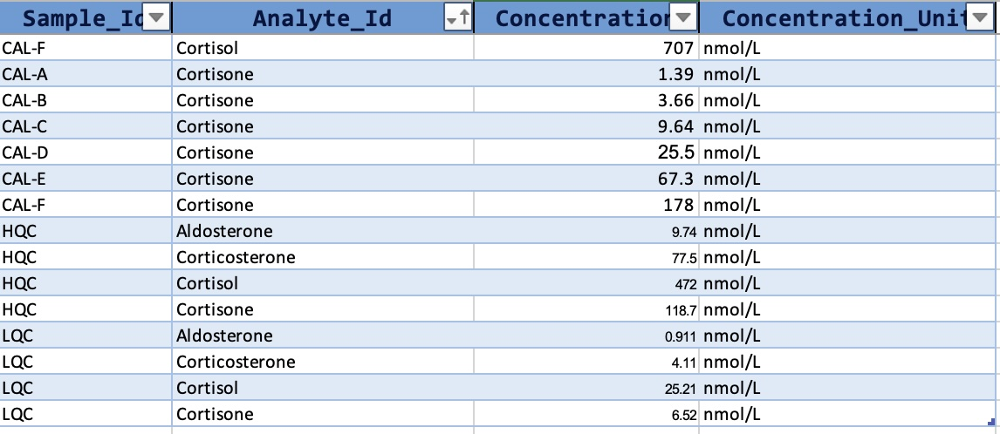

```{r, include = FALSE, echo = FALSE}
knitr::opts_chunk$set(collapse = TRUE, message = FALSE, comment = "#>", out.width = "100%")
set.seed(1041)

options(dplyr.print_max = 10)
```

<p class="page-kind page-kind-recipe">Recipe</p>

This vignette demonstrates a simple workflow for a quantitative targeted
assay with external calibration and quality control samples, as used
e.g., in clinical chemistry or environmental analysis.

For this type of analysis the known/target concentrations for the
calibrator and QC samples must be defined in the `QCconcentrations`
metadata. This also requires that `sample_id` and `analyte_id` is
defined for the corresponding analyses in the analysis, and for the
features in the feature metadata tables, respectively.

{width="588"}

The data and metadata are first imported from a MassHunter CSV file and
an MSOrganiser template file. The datasets used in this example can be
obtained from <https://github.com/SLINGhub/mrmhub/tree/main/data-raw>.

```{r, fig.height=3, fig.width=7}
#| results: true 
#| message: false
#| fig.alt: >
#|   Calibration plots
library(mrmhub)

# Create a new MRMhubExperiment data object
mexp <- MRMhubExperiment(title = "Corticosteroid Assay")

# Import analysis data (peak integration results) from a MassHunter CSV file
mexp <- import_data_masshunter(
  data = mexp,
  path = "QuantLCMS_Example_MassHunter.csv",
  import_metadata = TRUE)

# Import metadata from an MSOrganiser template file
mexp <- import_metadata_msorganiser(
  mexp,
  path = "datasets/QuantLCMS_Example_MetadataTemplate.xlsx",
  excl_unmatched_analyses = TRUE, ignore_warnings = TRUE)
```

Next, the raw peak areas are normalized with the corresponding internal
standard, and the regression fits for the external calibration curves
are then calculated and plotted.

```{r, fig.height=3, fig.width=7}
#| results: true 
#| message: false
#| fig.alt: >
#|   Calibration plots
# Normalize data by internal standards (defined in feature metadata)
mexp <- normalize_by_istd(mexp)

# Calculate calibration results. The regression model and weighting 
# can also be specified per feature in the feature metadata
mexp <- calc_calibration_results(
  mexp, 
  fit_overwrite  = TRUE,  # Set to FALSE if defined in metadata
  fit_model = "quadratic", 
  fit_weighting = "1/x")

# Plot calibration curves
  plot_calibrationcurves(
    data = mexp, zoom_n_points = 4,
    fit_overwrite = TRUE,  # Set to FALSE if defined in metadata
    fit_model = "quadratic",
    fit_weighting = "1/x",log_scale = TRUE,
    rows_page = 2,
    cols_page = 4, show_progress = FALSE)
  
```

A summary of the calibration curve results can also be produced:

```{r, fig.height=3, fig.width=7}
#| fig.alt: >
#|   Calibration plots
tbl_cal <- get_calibration_metrics(mexp)
tbl_cal
```

The summary includes the limit of detection (`lod`) and limit of quantification
(`loq`) for each feature, calculated following the ICH Q2(R1/R2) approach
(LoD = 3.3 σ / S, LoQ = 10 σ / S), where σ is the residual standard error of the
regression and S is the slope of the calibration curve at zero concentration
(the linear coefficient; the quadratic term does not contribute to this slope).

Once the curves have been inspected and the quality of the analysis is
satisfactory, the concentrations for all features in samples can be
calculated using the external calibration curves.

A summary of the QC results (bias and variability) is calculated and
shown below. The final concentration data is saved to a CSV file.

```{r, fig.height=3, fig.width=7}
#| fig.alt: >
#|   Calibration plots
#|   
# Calculate concentrations for all samples using external calibration
mexp <- quantify_by_calibration(
  mexp,
  fit_overwrite = FALSE,
  include_qualifier = FALSE,
  ignore_failed_calibration = TRUE,
  fit_model = "quadratic",
  fit_weighting = "1/x")

# get a table with QC results (bias and variability)
tbl <- get_qc_bias_variability(mexp, qc_types = c("HQC", "LQC"))

# Save a table with final concentration data
 save_dataset_csv( mexp, 
                   path = "corticosteroid_conc.csv", 
                   variable = "conc", 
                   filter_data = FALSE)
 
 print(tbl)
```

## Next steps

- [Calibration by a Reference Sample](tutorial-07-calibration-reference.html) — an alternative to external calibration curves
- [Custom QC Report](recipe-02-custom-qc-report.html) — build a formatted QC report from processed data
- [Visualisation Functions](manual-08-visualization.html) — the plotting reference, including calibration and QC plots
