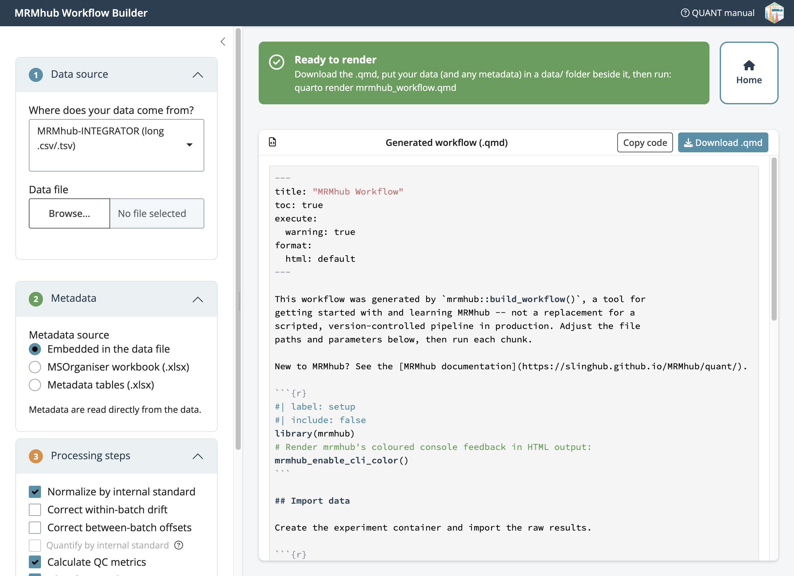
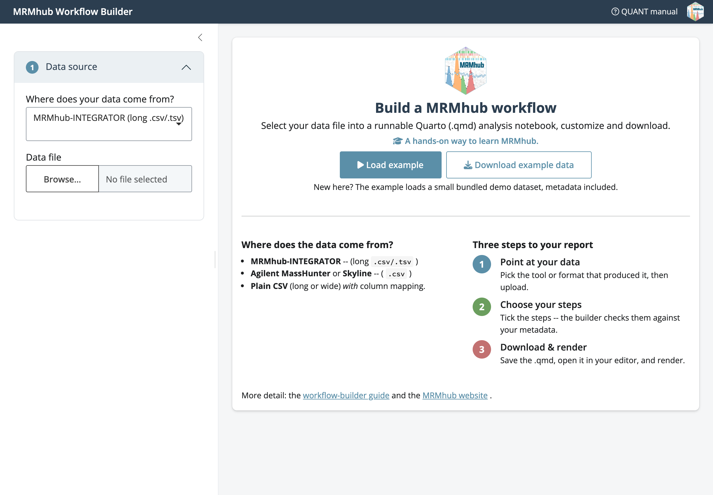

```{r setup, include = FALSE}
source("_common.R")
knitr::opts_chunk$set(eval = FALSE)
```

<p class="page-meta"><span class="page-kind page-kind-tutorial">Tutorial</span> <span class="page-prereq">Prerequisites: <a href="manual-00-installation.html">MRMhub installed</a></span></p>

`build_workflow()` opens a point-and-click app that turns a data file and its
metadata into a runnable Quarto (`.qmd`) workflow. You fill in the sidebar, the
app checks your inputs, and it writes the same script you would otherwise type
by hand. It is meant for getting started with and learning MRMhub; for a
production pipeline, script the steps yourself, using the generated `.qmd` as a
starting point.

::: {.callout .callout-getstarted}
New to R? The builder runs from R, so you need R and an editor (RStudio or
Positron) installed. If you have never used R, start with
[Getting started with R and Quarto](tutorial-13-getting-started-r-quarto.html) --
it covers installing R, using the console, and installing MRMhub.
:::

{width="65%"}

## Steps

1. Install MRMhub, if you have not already, by following the
   [installation guide](manual-00-installation.html). You only need to do this
   once.

2. Launch the builder from the Console in RStudio or Positron. Type one line and
   press Enter:

    ```r
    mrmhub::build_workflow()
    ```

    The app opens in your browser on a welcome screen. To try it with no files of
    your own, click Load example, or Download example data to save the demo file
    first.

    {width="65%"}

3. In the Data source panel, pick the tool or format that produced your data
   (MRMhub-INTEGRATOR, MassHunter, Skyline, or a generic CSV) and upload the
   file. For a generic CSV, use Configure columns to map them.

4. In Metadata, choose where sample, feature, and ISTD annotations come from:
   embedded in the data file, an MSOrganiser workbook, or a Metadata tables
   workbook. For the latter two, upload the `.xlsx`; the builder accepts it
   leniently, suppressing import warnings by default.

5. Under Processing steps, tick the steps to include. A greyed-out step explains,
   via its tooltip, what metadata it still needs — quantification by internal
   standard, for instance, stays off until ISTD concentrations are imported.
   Drift correction uses a QC type found in your data; if none is present, the
   step is written commented-out with a hint.

6. Under Report format, choose HTML, Word, or PDF for the rendered report.

7. Watch the status banner. A green banner, with the render command, means the
   workflow will run; amber flags something still missing; red appears only when
   the data file itself cannot be read. The Home button beside it starts over.
   The generated `.qmd` is always shown, whatever the banner's colour.

8. Click Download .qmd, make a `data/` folder next to it, copy your data (and any
   metadata) file into that folder, then render:

    ```bash
    quarto render mrmhub_workflow.qmd
    ```

::: {.callout .callout-tip}
The result is an ordinary Quarto document. Open it in RStudio, Positron, or
VS Code, tweak paths or steps, and run the chunks yourself.
:::

## Next steps

- [Getting started with MRMhub](tutorial-02-getting-started-mrmhub.html): the same workflow
  written by hand
- [Lipidomics workflow](tutorial-03-lipidomics-workflow.html): the full pipeline the
  builder mirrors
- [Quarto workflows](manual-11-quarto-workflows.html): rendering to HTML, PDF,
  and Word
